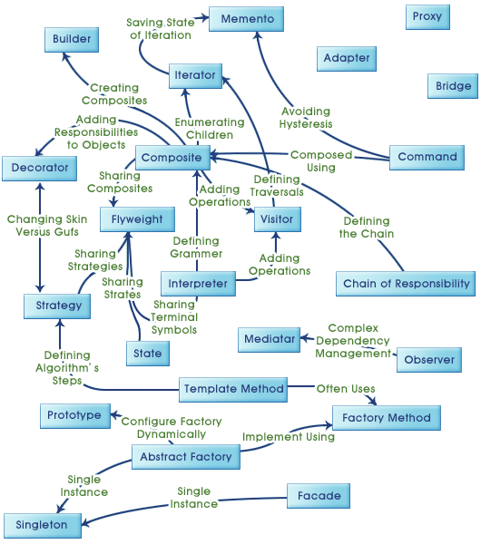
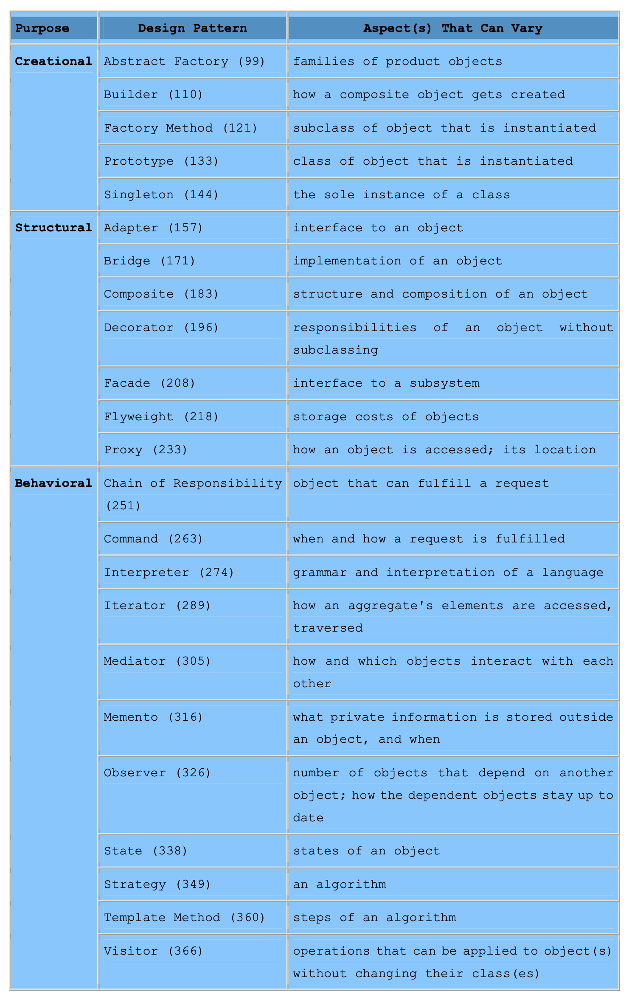

객체지향 소프트웨어 설계는 근본적으로 힘들고, 재사용 가능한 소프트웨어를 설계하는 건 더 힘들다.

처음부터 “제대로” 설계하는 건 매우 힘들고, 보통은 완성되기 전 계속 재사용을 시도하며 수정을 반복한다.

경험있는 설계자들은:

1. 모든 문제를 원칙으로 풀려하지 않는다
2. 그 대신 이전에 좋았던 해결책을 쓰고 또 쓴다
3. 익숙해지면 새 패턴을 찾으려고 하는 게 아니라 이럴 때 이걸 대입해보고 하는 식으로 적용해본다

계속 써도 되나요?

소설을 쓸 때도 주요 장르 별 패턴을 따른다. 코드를 짜는 것도 마찬가지인데, 객체지향 디자인에 맞는 상태표현/기능추가제거 용이성 의 패턴을 따르면 디자인 결정이 자동으로 따라온다.

GoF의 디자인 패턴은 이미 여러 시스템에 적용되어왔던 내용들을 다룬다.

## 디자인 패턴이 뭔가요?

크로스토퍼 알렉산더는 이런 말을 했다:

> "패턴이란, 우리가 개발 환경에서 반복적으로 마주치는 문제를 설명하고, 그 문제의 핵심 해결책을 제시하는 것입니다. 이 해결책은 마치 템플릿처럼 백만 번이고 재사용할 수 있으나, 실제 상황에 맞추어 매번 다르게 적용할 수 있습니다.” [AIS+77]
>
> Christopher Alexander, Sara Ishikawa, Murray Silverstein, Max Jacobson, Ingrid Fiksdahl-King, and Shlomo Angel. *A Pattern Language*. Oxford: Oxford University Press, 1977.
>
> (Gemma, DeepL, Claude Sonnet 3.5 결과를 토대로 의역)
> 

이 말이 시사하는 바는,

1. 반복되는 문제가 있는데
2. 주요 “패턴”은 이를 해결하는 핵심 해결책을 제시한다. 어디까지나 기본 원칙으로서.
3. 그리고 “백만 번(*million times*)”을 사용해도 상황에 맞추어 응용할 수 있음을 말한다.

패턴은 아래 핵심 요소를 가지고 있는데:

1. 패턴 이름
    1. 반복되는 문제에 대한 이름을 정의
2. 문제
    1. 패턴을 적용하는 상황을 설명
3. 해결책
    1. 패턴을 구성하는 디자인 방안, 관계와 책임 그리고 협력을 설명함
4. 결과
    1. 완성품 - 이런 장점을 가져갈 수 있다 라는 것
    2. 트레이드오프 - 좋긴한데 코드가 복잡해지니 상황에 맞게 쓰라는 가이드

tl;dr

디자인 패턴은 특정 상황에서 일반적인 설계 고민을 해결하기 위한 방안이다.

## MVC(Model/View/Controller) 에 적용되는 디자인패턴

Model/View/Controller 삼박자(*triad*) 구성에 어떤 식으로 디자인패턴이 녹아있는지 살펴보자.

### MVC가 뭐에요?

- Model: 애플리케이션 오브젝트
- View: 화면에 뿌리는 방안
- Controller: 사용자 입력에 대응하는 방법

### 이걸 왜썼대요? (1)

1. view와 model의 결합도를 낮추기 위함 - 구독(*subscribe*)/통지(*notify*) 프로토콜을 그 사이에 둠으로써 처리
2. 방안
    1. model의 데이터가 변경되면 view가 통지(*notify*)를 받고 보여줌
    2. view는 자기 스스로 값을 업데이트할 수 있는 기회를 얻게 됨
3. 장점
    1. 여러 view를 model에 붙여서 각각 다른 “표현”방식을 채택할 수 있음
    (E.g., 스프레드시트로, 히스토그램으로, 파이차트로)

핵심:

- 객체간 결합도를 낮추었음
- 한 객체의 변화가 다른 객체에 영향을 줄 수 있음
- 이 변화가 다른 객체에게 영향은 주지만 그 대상의 구체적인 내부 구현을 알 필요가 없다

spoiler alert: 여기선 옵저버 패턴이 쓰임

### 이걸 왜썼대요? (2)

1. view는 중첩이 가능함
e.g., 제어판 버튼은 되게 복잡한 버튼들이 있을 수 있음
2. 방안
    1. `CompositeView` 라는 뷰의 서브클래스가 있음
    2. 이를 이용해서 중첩가능한 버튼 패널 처리가 가능함
3. 장점
    1. 복잡한 내용은 구조 속에 숨김 - 사용하는 입장에선 단순히 `CompositeView` 만 씀
    2. 새로운 종류의 Component 추가가 용이함

핵심:

- 재귀적 구조를 활용해 복잡한 중첩 구조를 효과적으로 처리
    - "has-a"와 "is-a" 관계를 동시에 표현
    - 단일 인터페이스를 사용해도 복잡한 부분이 포함되게 할 수 있음

spoiler alert: 여기선 컴포지트 패턴이 쓰임

### 이걸 왜 썼대요? (3)

1. MVC는 view를 안 바꾸고도 view가 사용자 입력에 응답하는 방식을 바꿀 수 있음
2. 방안
    1. “컨트롤러”를 교체 및 추가할 수 있음
    2. view가 행동하는 “컨트롤러”의 처리방식을 얼마든지 교체할 수 있음
3. 장점 - 예시로 표현
    1. 버튼(view)는 그대로 있는데 “반응하는 형식”을 바꿀 수 있음
        - 버전 A: 클릭하면 바로 저장
        - 버전 B: 클릭하면 "정말 저장하시겠습니까?" 확인 팝업을 먼저 보여줌
        - 버전 C: 단축키(Ctrl+S)로도 활성화되게 함

핵심

- 입력 방식과 화면 요소의 결합도를 낮춤.
- View는 동일하게 유지되지만, Controller를 교체하여 입력 처리 방식을 유연하게 변경 가능.
- 변화에 따른 확장성이 높아짐:
    - 사용자 입력 처리 로직이 Controller에 캡슐화되어, 입력 방식의 추가나 수정이 기존 View에 영향을 주지 않음.
    - 동일한 View를 사용해도, 다른 Controller를 연결하면 새로운 동작을 구현할 수 있음.

spoiler alert: 여기서는 스트래티지 패턴이 사용됨

추가로…

- 기본 컨트롤러 클래스를 정의하기 위해 템플릿 메소드 패턴을 사용
- 뷰에 “스크롤링” 기능을 추가하기 위해 데코레이터 패턴을 사용

등, 수많은 패턴이 필요에 따라 쓰일 수 있음

## 디자인 패턴 설명하기

이 책은…

1. 과정과 결과, 대안 및 트레이드오프를 설명할 것
2. 일관된 형식을 따를 것임

그 방식은….

- 패턴 이름/분류
- 목적(*intent*) - 해결하고자 하는 문제
- aka
- 문제 상황/배경(*motivation*)
- 적용가능한 상황(*applicability*)
- 코드 구조
- 구성요소
- 협력관계
- 패턴의 영향
- 구현 시 고려사항
- 대표 예시
- 연관 패턴

으로 설명될 예정이다.

## 디자인 패턴 카탈로그

## **생성 패턴 (Creational Patterns)**

- 추상 팩토리 (Abstract Factory) - 구체적인 클래스를 지정하지 않고도 서로 관련되거나 의존적인 객체들의 집합을 생성하기 위한 인터페이스를 제공한다.
- 빌더 (Builder) - 복잡한 객체의 생성 과정과 표현 방법을 분리하여 동일한 생성 절차에서 서로 다른 표현 결과를 만들 수 있게 한다.
- 팩토리 메서드 (Factory Method) - 객체 생성을 위한 인터페이스를 정의하지만, 인스턴스를 생성할 클래스의 결정은 서브클래스가 담당하도록 한다. 이를 통해 클래스의 인스턴스 생성을 서브클래스에게 위임할 수 있다.
- 프로토타입 (Prototype) - 원형이 되는 인스턴스를 사용하여 생성할 객체의 종류를 명시하고, 이 원형을 복사하여 새로운 객체를 생성한다.
- 싱글턴 (Singleton) - 클래스의 인스턴스가 오직 하나만 존재하도록 보장하고, 이 인스턴스에 대한 전역적인 접근점을 제공한다.

## **구조 패턴 (Structural Patterns)**

- 어댑터 (Adapter) - 클래스의 인터페이스를 클라이언트가 기대하는 다른 인터페이스로 변환한다. 호환되지 않는 인터페이스 때문에 함께 동작할 수 없는 클래스들이 협력하도록 해준다.
- 브리지 (Bridge) - 추상화와 구현을 분리하여 두 요소가 독립적으로 변형될 수 있도록 한다.
- 컴포지트 (Composite) - 객체들을 트리 구조로 구성하여 부분-전체 계층구조를 표현한다. 클라이언트가 개별 객체와 복합 객체를 동일하게 다룰 수 있도록 한다.
- 데코레이터 (Decorator) - 객체에 동적으로 새로운 책임을 추가할 수 있게 한다. 기능을 확장하기 위한 유연한 대안을 제공한다.
- 퍼사드 (Facade) - 서브시스템에 있는 인터페이스 집합에 대해 통합된 인터페이스를 제공한다. 서브시스템을 더 쉽게 사용할 수 있도록 상위 수준의 인터페이스를 정의한다.
- 플라이웨이트 (Flyweight) - 많은 수의 작은 객체들을 효율적으로 지원하기 위해 객체 공유를 사용한다.
- 프록시 (Proxy) - 다른 객체에 대한 접근을 제어하기 위해 대리자나 자리표시자를 제공한다.

## **행위 패턴 (Behavioral Patterns)**

- 책임 연쇄 (Chain of Responsibility) - 요청의 발신자와 수신자를 분리하여 여러 객체에게 요청을 처리할 기회를 부여한다. 수신 객체들을 체인으로 연결하고 요청이 처리될 때까지 체인을 따라 전달한다.
- 커맨드 (Command) - 요청을 객체로 캡슐화하여 클라이언트를 다양한 요청으로 매개변수화할 수 있게 한다. 요청을 큐에 저장하거나 로그로 기록하고, 작업 취소도 지원할 수 있다.
- 인터프리터 (Interpreter) - 주어진 언어에 대해, 해당 언어의 문법을 위한 표현 방법을 정의하고, 이와 함께 문장을 해석하는 인터프리터를 사용한다.
- 반복자 (Iterator) - 내부 표현 방식을 노출하지 않고도 집합 객체의 요소들을 순차적으로 접근할 수 있는 방법을 제공한다.
- 중재자 (Mediator) - 객체들이 서로 직접 참조하지 않고도 상호작용할 수 있도록 캡슐화한다. 객체 간의 결합도를 낮추고 독립적인 상호작용이 가능하도록 한다.
- 메멘토 (Memento) - 캡슐화를 위반하지 않은 채로 객체의 내부 상태를 캡처하고 외부에 저장했다가 나중에 해당 상태로 복구할 수 있게 한다.
- 옵저버 (Observer) - 객체들 사이에 일대다 의존 관계를 정의하여, 한 객체의 상태가 변하면 그에 의존하는 모든 객체들이 자동으로 통지받고 갱신되도록 한다.
- 상태 (State) - 객체의 내부 상태가 변경될 때 행동을 변경할 수 있게 한다. 마치 객체의 클래스가 바뀌는 것처럼 보이게 한다.
- 전략 (Strategy) - 알고리즘군을 정의하고 각각을 캡슐화하여 교환해서 사용할 수 있게 한다. 알고리즘을 사용하는 클라이언트와 독립적으로 알고리즘을 변경할 수 있다.
- 템플릿 메서드 (Template Method) - 알고리즘의 골격을 정의하고 일부 단계를 서브클래스로 미룬다. 서브클래스가 알고리즘의 구조를 변경하지 않고도 특정 단계를 재정의할 수 있게 한다.
- 방문자 (Visitor) - 객체 구조의 요소들에 수행할 작업을 표현한다. 요소 클래스를 변경하지 않고도 새로운 작업을 정의할 수 있게 한다.

## 카탈로그를 그룹화 해봅시다

디자인 패턴은 '목적'(생성/구조/행위)과 '범위'(클래스/객체)라는 두 가지 기준으로 분류된다.

### 목적

패턴이 하는 일 자체를 나타냄

- 생성: 객체의 생성과정
- 구조: 클래스나 객체의 구성
- 행위: 클래스, 객체의 상호작용 및 책임 분산

## 범위

패턴이 적용되는 범위

- 클래스: 클래스와 서브클래스 간 관계. 상속이나 구현을 통해 확립. 컴파일 시점에 고정
- 객체: 객체 관의 관계. Composition, Aggregation 같은 관계를 의미함. 실행시점에 변경될 수 있음

<<표는 refactoring.guru의 표를 넣자>>

가장 중요한 그림이 나온다. 디자인 패턴 간의 관계를 표현하는 그림이다.



## 디자인 패턴이 문제를 해결하는 방법

### 적절한 객체 찾기

객체지향 프로그램은 객체로 이루어져있다. 객체는 데이터와 프로시저를 함께 내포하고 있는데, 그 프로시저는 메소드라고 부른다. 객체는 요청(혹은 메시지(*message*))을 클라이언트로부터 받고 작동을 수행한다.

“요청”은 객체가 작동을 수행하는 유일한 방법이다. 작동은 객체가 자신의 값을 바꾸는 유일한 방법이다. 이런 제한때문에 객체의 내부 상태는 *캡슐화* 되는 것이다. 직접 제어할 수 없음을 의미한다.

객체지향 설계의 가장 어려운 부분은 시스템을 객체들로 분해하는 것이다. 이 작업이 어려운 이유는 캡슐화, 세분성(*granularity*), 의존성, 유연성, 성능, 진화, 재사용성 등 수많은 요소들이 작용하기 때문이다. 이러한 요소들은 모두 분해 과정에 영향을 미치며, 종종 서로 상충되는 방향으로 작용한다.

설계상의 많은 객체는 분석모델로부터 나온다. 객체지향적 설계를 하다보면 현실에 존재하지 않는 개념이 생기기도 한다. 너무 엄격하게 설계하면 유연하지 못하므로 추상화 및 구현체를 어떻게 잘 균형잡는지 파악해야한다. 디자인 패턴은 이런 부분에 도움을 줄 수 있다. Composite 패턴은 객체를 균일하게 다루기 위한 추상화이며 Strategy 패턴은 교체가능한 알고리즘을 구현하는 방법을, State 패턴은 객체의 상태를 별도 객체로 표현한다.

### 객체의 세분성(granularity) 결정하기

객체를 뭘로 잡고 설계할지에 따라 그 수와 크기가 천차만별로 변한다. 하드웨어 수준의 작은 것부터 전체 애플리케이션까지 표현할 수 있다.

디자인패턴은 무엇을 객체로 만들어야할지 결정하는 데 도움을 준다. Facade 패턴은 전체 서브시스템을 마치 하나의 객체처럼 표현하는 방법을 보여준다. Flyweight 패턴은 아주 작은 객체 단위를 효율적으로 다루는 방법을 보여준다. Abstract Factory 와 Builder는 객체 생성의 “책임”을 담당하는 객체를 만든다. Visitor와 Command는 다른 객체 또는 객체 그룹에 대한 요청을 수행하는 것만을 “책임”지는 객체를 만든다.

### 객체 인터페이스 구체화하기

- 객체에 선언된 연산은 이름, 받는 매개변수, 리턴값을 정의한다. 이는 함수의 시그니처(*Signature*) 라고 한다. 객체 작동에 필요한 시그니처들의 집합은 객체의 인터페이스라고 한다[^1]. 인터페이스에 정의된 모든 요청은 그 객체에 보낼 수 있다.
- 타입은 특정 인터페이스를 가리키는데 쓰이는 이름이다. 예를 들어 `Window` 타입을 가지는 객체는 `Window` 인터페이스에 정의된 모든 요청을 처리할 수 있다(E.g., `class Mp3Player implements Playable, Streamable` 같은 식으로). 만일 타입의 인터페이스가 다른 상위 타입의 인터페이스를 포함하면, 서브타입이라고 부른다. 서브타입은 상위타입의 인터페이스를 상속(*inheriting*) 한다고 한다.
    
    ```java
    // 동물의 기본적인 행동을 정의하는 상위 타입
    interface Animal {
        void eat();
        void sleep();
    }
    
    // Animal의 모든 기능을 포함하고, 추가 기능이 있는 하위 타입
    interface Pet extends Animal {
        void play();    // 추가된 기능
        void eat();     // Animal의 기능
        void sleep();   // Animal의 기능
    }
    
    // Pet은 Animal의 모든 기능을 포함(eat, sleep)하면서, 
    // 추가 기능(play)도 가지고 있으므로 Animal의 서브타입
    ```
    
    1. **타입 호환성**:
        - Pet 타입의 객체는 Animal 타입이 필요한 모든 곳에서 사용될 수 있음
        - 왜냐하면 Pet은 Animal의 모든 기능을 포함하고 있기 때문
        
        ```java
        Animal myAnimal = new Dog(); // Dog가 Pet을 구현하면 가능
        ```
        
    2. **리스코프 치환 원칙**
        - 상위 타입의 객체를 하위 타입의 객체로 대체할 수 있어야 한다는 원칙
        - Pet은 Animal의 모든 기능을 가지고 있으므로, Animal이 사용되는 곳에 Pet을 사용해도 됨
    3. 확장성
        
        ```java
        interface ServiceAnimal extends Pet {
            void work();    // 또 다른 추가 기능
        }
        ```
        
        - `ServiceAnimal`은 Pet의 모든 기능(play)과 Animal의 모든 기능(eat, sleep)을 포함
- 객체에 요청이 전송될 때 실제 구동되는 연산은 요청과 수신하는 객체 모두에 따라 달라진다. 요청과 객체 및 그 연산 중 하나를 실행 시점에 연결하는 것을 동적 바인딩(*Dynamic binding*)이라 한다.
- 동적 바인딩은 요청을 보낼 때 특정 구현에 고정되지 않고 실행 시점까지 결정을 미룬다는 것을 의미한다. 결과적으로 특정 인터페이스를 가진 객체를 기대하는 프로그램을 작성할 수 있으며, 해당 인터페이스를 올바르게 가진 어떤 객체든 그 요청을 받아들일 것임을 알 수 있다.
- 동적 바인딩은 실행 시점에 동일한 인터페이스를 가진 객체들을 서로 교체할 수 있게 한다. 이러한 대체 가능성을 다형성(*Polymorphism*)이라고 하며, 이는 객체지향 시스템의 핵심 개념. 다형성은 클라이언트 객체가 특정 인터페이스를 지원하는 것 외에는 다른 객체들에 대해 거의 가정을 하지 않아도 되게 함. 다형성은 클라이언트의 정의를 단순화하고, 객체들을 서로 분리시키며, 실행 시점에 그들 간의 관계를 변경할 수 있게 한다.
    
    ```java
    // 동적 바인딩과 다형성 예시
    interface MessageSender {
        void sendMessage(String message);
    }
    
    class EmailSender implements MessageSender {
        @Override
        public void sendMessage(String message) {
            System.out.println("Sending email: " + message);
        }
    }
    
    class SMSSender implements MessageSender {
        @Override
        public void sendMessage(String message) {
            System.out.println("Sending SMS: " + message);
        }
    }
    
    class NotificationService {
        private MessageSender sender;  // 인터페이스 타입으로 참조
    
        // 어떤 구현체가 들어올지 실행 시점까지 알 수 없음
        public NotificationService(MessageSender sender) {
            this.sender = sender;
        }
    
        public void notify(String message) {
            // 동적 바인딩: 실제 호출되는 sendMessage는
            // 실행 시점에 결정됨
            sender.sendMessage(message);
        }
    }
    ```
    
    - **동적 바인딩**:
        - `sender.sendMessage(message)`가 실행될 때
        - 어떤 구현체(`EmailSender` 또는 `SMSSender`)의 메서드가 호출될지는 실행 시점에 결정
    - **다형성**:
        - `NotificationService`가 `MessageSender` 인터페이스만 알고 있어도 됨
        - `EmailSender`나 `SMSSender`를 자유롭게 교체해서 사용할 수 있음

디자인 패턴은 핵심 요소와 인터페이스 간 주고받는 데이터의 종류를 식별함으로써 인터페이스 정의에 도움을 준다. 그리고 인터페이스에 무엇을 포함할지 말아야 하는지도 알려준다.

- Memento 패턴은 객체 내부상태를 캡슐화 후 복원하는 방안을 설명한다.

디자인 패턴은 인터페이스 간 관계도 명시한다. 일부 클래스는 유사한 인터페이스를 가지도록 요구할 수도 있으며, 제약을 둘 수도 있다.

- Decorator 패턴, Proxy 패턴 - decorated object, proxied object와 동일해야함
- Visitor 패턴 - visitor가 방문하는 모든 객체 클래스를 반영해야 함

### 객체 구현체 구체화하기

선언하는 법에 대해 살펴봤으니 구현하는 방법에 대해 알아보자. 클래스는 객체의 내부 데이터와 표현, 오브젝트가 수행할 연산을 구체화한다.

- 객체는 클래스를 인스턴스화함으로써 생성된다. 이때 객체는 해당 클래스의 인스턴스라고 말한다. 클래스를 인스턴스화하는 과정은 객체의 내부 데이터(인스턴스 변수들로 구성된)를 위한 저장 공간을 할당하고, 이 데이터와 연산들을 연결하는 것이다. 클래스를 인스턴스화하여 비슷한 여러 객체 인스턴스들을 생성할 수 있다.
    
    ```java
    // 클래스 정의
    class Car {
        private String model;  // 인스턴스 변수
        
        public void drive() { // 연산(operation)
            // 구현
        }
    }
    
    // 객체 인스턴스화
    Car myCar = new Car();  // Car 클래스의 인스턴스
    ```
    
- 클래스 상속을 사용하면 기존 클래스를 기반으로 새로운 클래스를 정의할 수 있다. 서브클래스가 부모 클래스로부터 상속받을 때, 부모 클래스가 정의한 모든 데이터와 연산의 정의를 포함하게 된다. 서브클래스의 인스턴스인 객체들은 해당 서브클래스와 그 부모 클래스들이 정의한 모든 데이터를 포함하며, 이 서브클래스와 부모들이 정의한 모든 연산을 수행할 수 있다.
    
    ```java
    abstract class Vehicle {  // 추상 클래스
        abstract void move();  // 추상 연산
        
        void stop() {  // 구체적인 연산
            System.out.println("Stopping");
        }
    }
    
    // Vehicle을 상속받는 구체(concrete) 클래스
    class Car extends Vehicle {
        @Override
        void move() {  // 추상 연산의 구현
            System.out.println("Driving");
        }
    }
    ```
    
- 추상 클래스는 주된 목적이 서브클래스들을 위한 공통 인터페이스를 정의하는 것인 클래스다. 추상 클래스는 구현의 일부 또는 전부를 서브클래스에서 정의된 연산들에 위임한다. 즉 추상 클래스는 인스턴스화될 수 없다.
추상 클래스가 선언하지만 구현하지 않는 연산들을 추상 연산(*abstract operation*)이라고 일컫는다. 추상 클래스가 아닌 클래스들을 구체 클래스(*concrete class*)라 일컫는다.
- 서브클래스들은 부모 클래스의 동작을 개선하거나 재정의할 수 있다. 더 구체적으로, 클래스는 부모 클래스가 정의한 연산을 재정의(오버라이드)할 수 있다. 오버라이딩은 서브클래스가 부모 클래스 대신 요청을 처리할 수 있는 기회를 제공한다. 클래스 상속을 통해 다른 클래스들을 확장하는 것만으로도 클래스를 정의할 수 있어, 관련된 기능을 가진 객체 집합을 쉽게 정의할 수 있다.
    
    ```java
    class ElectricCar extends Car {
        @Override
        void stop() {  // 부모 클래스의 동작을 재정의
            System.out.println("Regenerative braking");
        }
    }
    ```
    
- 믹스인 클래스는 다른 클래스에 선택적 인터페이스, 기능을 제공하기위한 클래스다. 믹스인 클래스는 인스턴스화 될 수 없다(추상 클래스와 유사). 믹스인 클래스는 다중상속 기능이 필요하다.
    
    ```python
    class CustomListMixin:
        """사용자 정의 리스트 믹스인"""
        
        def get_queryset(self):
            """기본 쿼리셋에 추가 필터링 적용"""
            queryset = super().get_queryset()
            
            # URL 파라미터에서 카테고리 필터링
            category = self.request.query_params.get('category', None)
            if category:
                queryset = queryset.filter(category=category)
                
            # 최신 글 순으로 정렬
            queryset = queryset.order_by('-created_at')
            
            return queryset
        
        def list(self, request, *args, **kwargs):
            """리스트 조회 메소드 오버라이드"""
            queryset = self.get_queryset()
            page = self.paginate_queryset(queryset)
            
            if page is not None:
                serializer = self.get_serializer(page, many=True)
                response_data = {
                    'status': 'success',
                    'count': queryset.count(),
                    'results': serializer.data
                }
                return self.get_paginated_response(response_data)
    
            serializer = self.get_serializer(queryset, many=True)
            response_data = {
                'status': 'success',
                'count': queryset.count(),
                'results': serializer.data
            }
            return Response(response_data)
    
    class PostListView(CustomListMixin, generics.ListAPIView):
        """게시글 목록 조회 뷰"""
        queryset = Post.objects.all()
        serializer_class = PostSerializer
        
        def get_serializer_context(self):
            """시리얼라이저에 추가 컨텍스트 전달"""
            context = super().get_serializer_context()
            context['request'] = self.request
            return context
    ```
    

이 책에선

- 생성 패턴 - (Abstract Factory, Builder, Factory Method, Prototype and Singleton)이 이를 돕는다

### 클래스 vs 인터페이스 상속

객체의 클래스와 타입의 차이에 대해

- 객체의 클래스는 객체가 어떻게 구현되는지를 정의한다. 클래스는 객체의 내부 상태와 그 연산들의 구현을 정의한다.
- 객체의 타입은 오직 그 인터페이스, 즉 객체가 응답할 수 있는 요청들의 집합만을 나타낸다. 하나의 객체는 여러 타입을 가질 수 있으며, 서로 다른 클래스의 객체들이 같은 타입을 가질 수 있다.

상속과 구현의 차이에 대해

- 클래스 상속 (구현 상속)
    - 코드 재사용이 주 목적
    - 실제 구현 내용을 물려받음
    - "is-implemented-in-terms-of" (구현 관계)
    - 예: 자바에서 extends를 사용한 상속
- 인터페이스 상속 (타입 상속)
    - 다형성 제공이 주 목적
    - 객체의 타입만 정의
    - "is-a" (타입 관계)
    - 예: 자바에서 implements를 사용한 인터페이스 구현

상속 vs 구현?

- 상속의 한계점
    - 부모 클래스의 구현이 바뀌면 모든 자식 클래스에 영향
    - 부모 클래스의 내부 구현을 자식이 알아야 함
    - 이런 식의 상속이 깊어지면 더 복잡해짐
- 구현을 이용한 장점
    - 인터페이스만 알면 되기 때문에 세부사항에 덜 의존적임
    - 여러 인터페이스를 필요에 맞게 구현할 수 있고, 새 기능 추가시 기존 코드 변경이 최소화됨

..이런 이유로 아래 말이 나옴:

> Program to an interface, not an implementation.
> 

```java
// 나쁜 예: 구체 클래스에 직접 의존
class OrderService {
    // 구체 클래스에 직접 의존!
    private MySQLDatabase database = new MySQLDatabase();
    
    public void createOrder(Order order) {
        database.save(order);  // MySQLDatabase에 강하게 결합됨
    }
}

// 좋은 예: 인터페이스에 의존 + 생성 패턴 활용
interface Database {
    void save(Order order);
}

class OrderService {
    // 인터페이스에 의존
    private final Database database;
    
    // 생성자를 통해 구체적인 구현을 주입받음
    public OrderService(Database database) {
        this.database = database;
    }
    
    public void createOrder(Order order) {
        database.save(order);  // 어떤 Database 구현체가 오더라도 동작
    }
}

// 팩토리 패턴을 사용한 객체 생성
class DatabaseFactory {
    public static Database createDatabase(String type) {
        switch(type) {
            case "mysql":
                return new MySQLDatabase();
            case "mongodb":
                return new MongoDatabase();
            default:
                throw new IllegalArgumentException("Unknown database type");
        }
    }
}

// 실제 사용
public class Main {
    public void main() {
        // 객체 생성은 한 곳에서 집중적으로 처리
        Database database = DatabaseFactory.createDatabase("mysql");
        OrderService orderService = new OrderService(database);
        
        // 이후의 코드는 구체적인 구현을 알 필요가 없음
        orderService.createOrder(new Order());
    }
}
```

### 재사용 메커니즘의 종류

1. 상속(*Inheritance*) vs 합성(*Composition*)
- 화이트박스 재사용 (상속 기반)
    - 컴파일 타임에 정적으로 결정
    - 부모 클래스의 내부가 서브클래스에 visible
    - "상속은 캡슐화를 깨뜨린다"는 단점
- 블랙박스 재사용 (컴포지션 기반)
    - 런타임에 동적으로 객체 관계 설정 가능
    - 객체는 순수하게 인터페이스로만 소통
    - 더 나은 캡슐화와 유연성 제공

실천적 해결책?

- 추상 클래스 활용
    - 구현을 최소화하고 인터페이스를 주로 정의
    - 구현 의존성을 줄이는 방법
- 객체 컴포지션 설계의 특징
    - 각 클래스가 한 가지 작업에 집중
    - 클래스 계층이 작고 관리 가능한 상태 유지
    - 더 많은 객체, 더 적은 클래스
    - 시스템 동작이 객체들의 협력으로 결정

..이런 이유로 아래 말이 나옴:

> Favor object composition over class inheritance.
> 

1. 위임 (*Delegation*)
- 위임의 주요 장점
    - 런타임에 동작을 쉽게 변경할 수 있음
    - 단일 책임 원칙을 지키기 쉬움
    - 객체 간의 결합도를 낮출 수 있음
    - 더 유연한 설계가 가능
- 위임의 주요 단점
    - 너무 고도화된 경우 사람이 이해하기 어려워짐

실천적 해결책?

- 고도로 정형화된 방식으로 쓰일 때

이 책에선?

- State 패턴 - 객체의 현재 상태를 나타내는 state 객체에 요청을 위임
- Strategy 패턴 - 객체가 특정 요청을 처리할 때, 그 작업을 전담하는 전략 객체에 맡김

1. 상속 vs 매개변수화 타입(*Parametrized Type*)
- 매개변수화 타입의 주요특징
    - 일종의 Generic 타입으로 런타임에 타입이 정해짐
    - 그에 맞는 맞춤형 구현을 알아서 처리시킴

이 책에선? - 정렬예시와 함께

- 서브클래스가 구현하는 연산으로 (Template Method 패턴)
- 정렬 루틴에 전달되는 객체의 “책임”으로 (Strategy 패턴)
- 제너릭 타입으로

설계 및 구현 제약조건에 따라 픽하면 됨.

예시코드:

```java
List<String> list = new ArrayList<>();  // 제네릭
Collections.sort(list, new Comparator<String>() {  // 전략 패턴
    @Override
    public int compare(String a, String b) {
        return a.compareTo(b);
    }
});
```

1. 런타임, 컴파일타임 구조의 연관관계
- 집계(*Aggragation*) vs 인지(*Acquaintance*)
    - 집계: 한 객체가 다른 객체를 이미 소유하고있음, 책임도 짐
    - 인지: 알고만 있고, 객체간의 메시지 주고받는 것이 동적으로 변함

예시코드:

```java
// 컴파일 타임의 클래스 구조
class Car {
    private Engine engine;        // 집합(aggregation) - 자동차의 일부
    private FuelStation station;  // 지인 관계(acquaintance) - 단순히 알고 있음
    
    public Car() {
        this.engine = new Engine();  // 생성 시점에 함께 생성
    }
    
    public void refuel() {
        station.refuel(this);  // 단순히 서비스를 요청
    }
    
    public void setFuelStation(FuelStation station) {
        this.station = station;  // 런타임에 변경 가능
    }
}
```

```java
// 런타임의 객체 관계
public class Main {
    public void main() {
        Car car1 = new Car();
        Car car2 = new Car();
        
        FuelStation station1 = new GasStation();
        FuelStation station2 = new ElectricStation();
        
        // 런타임에 동적으로 관계가 형성됨
        car1.setFuelStation(station1);
        car2.setFuelStation(station2);
        
        // 나중에 변경 가능
        car1.setFuelStation(station2);
    }
}
```

이 책에선?

- Composite, Decorator 패턴 - 복잡한 런타임 구조를 구축할 때
- Observer 패턴 - 패턴을 모르면 감이 안오는 런타임 구조
- Chain of Responsibility 패턴 - 상속이 드러나지 않는 통신 패턴

### 변화에 대비한 설계

새 요구사항, 기존 요구사항의 변화를 예측하기. 그에 맞추어 시스템을 설계하기

변화를 고려하고 재설계를 생각해야 함. 클래스 재정의, 재구현, 클라이언트 수정, 재테스트(*re-testing*) 포함

재설계는 시스템의 많은 부분에 영향을 끼침. 예기치않은 변화는 비용임.

디자인 패턴을 활용하면 시스템의 변화를 특정 방식으로 유도할 수 있음. 또한 변화가 일어나더라도 독립적으로 변경될 수 있기 때문에 시스템이 보다 견고해짐

아래는 재설계의 일반적 원인과 이를 해결하는데 쓰이는 디자인 패턴들임:

1. 객체 생성 시 클래스를 명시적으로 지정
    - 향후 변경이 복잡해지므로 간접적으로 생성하도록 하는 것이 좋음
    - 생성패턴으로 해결 - Factory Method 패턴, Abstract Factory 패턴
    - DI(의존성 주입)와 ISP(인터페이스 분리 원칙) 원칙과 관계있음
2. 특정 연산에 대한 의존성
    - 요청을 처리하는 한 가지 방식에 종속됨
    - 하드코딩된 요청을 피함 - 컴파일 타임과 런타임에서 요청처리방식을 쉽게 변경할 수 있음 Strategy 패턴, Command 패턴
    - 다형성(Polymorphism), 개방-폐쇄 원칙과 관계있음
3. 하드웨어/소프트웨어 플랫폼에 대한 의존성
    - 외부 운영체제 인터페이스, API는 플랫폼마다 다른데, 이를 하드코딩하면 특정 플랫폼에 의존하게 됨
    - 의존성을 제한하도록 설계 - Adapter 패턴, Bridge 패턴
    - 의존성 역전 원칙(DIP), 추상화 계층 설계와 관계있음
4. 객체 표현이나 구현에 대한 의존성
    - 객체를 쓰는방법(저장, 구현 등)을 클라이언트가 알면 객체 사용법이 바뀌는 변화에 휘둘림
    - 클라이언트로부터 이런 정보를 숨김 - Façade 패턴, Proxy 패턴
    - 단일 책임 원칙(SRP), 정보 은닉의 기본원칙과 관계있음
5. 알고리즘 의존성
    - 알고리즘은 개발과정에서 자주 확장되고 최적화가 필요하고 교체가 잦음.
    알고리즘에 의존하는 객체들은 알고리즘이 변경될 때 함께 바뀌어야 함
    - 변경 가능성이 높은 알고리즘을 격리 - Strategy 패턴
    - 단일 책임 원칙(SRP), 개방-폐쇄 원칙(OCP)와 관계 있음
6. 강한 결합
    - 강한게 결합된 클래스들은 서로 의존하기 때문에 재사용이 어려워짐 → 클래스의 변화/제거가 어려워짐 → 시스템 파악이 어려워지고, 이식이 어려워짐 ⇒ 유지보수가 어려워짐
    - 의존성 분리 - Observer 패턴, Mediator 패턴
    - 결합도, 응집도의 기본 원칙, SOLID 원칙 전반과 관계있음
7. 서브클래싱을 통한 기능 확장
    - 부모 클래스를 다 알아야함. 구현 오버헤드가 있음 → 서브클래싱으로 객체를 커스텀하는 것은 한계가 있음
    - 객체 구성 및 위임으로 유연하게 대처 - Decorator 패턴, Bridge 패턴
    - Composition over Inheritance 원칙, 리스코프 치환 원칙(LSP)과 연관있음
8. 클래스를 편리하게 변경할 수 없는 상황
    - 쉽게 바꿀 수 없는 클래스를 바꾸어야 하는 경우가 있음 (소스코드가 없거나 수많은 기존 서브클래스를 수정해야함)
    - 적용가능한 패턴 - Adapter 패턴, Decorator 패턴
    - 개방-폐쇄 원칙(OCP), 의존성 역전 원칙(DIP)과 연관있음

핵심은:

- 캡슐화, 추상화, 다형성, 상속을 효과적으로 활용
- 시스템의 유연성, 확장성을 보장하기 위함

### 디자인 패턴 고르는 법

1. 디자인 패턴이 설계의 어려운 부분을 해결하는 방식 이해하기
2. 의도(*intent*) 부분을 훑어보기 - 비즈니스 로직 해결을 위한 패턴을 이해하기
3. 패턴 간의 관계를 익히기
4. 목적이 비슷한 패턴 연구하기
5. 재설계의 원인을 살펴보기 - 하나 이상의 원인이 연관있나 살펴보기
6. 디자인에서 변동 가능한 요소 고려하기
    1. 이 접근 방법은 재설계 원인에 집중하는 것과 반대관점 
    2. 디자인 변경을 강요하는 요소 대신, 재설계 없이 변경하고 싶은 부분을 고려할 것
    3. 변할 수 있는 개념을 캡슐화할 것 - 디자인 패턴의 핵심 주제
    4. 아래 표에서는 디자인 패턴이 독립적으로 변할 수 있게 해주는 디자인 요소들을 나열하고 있음 → 이를 통해 재설계 없이도 변화를 적용할 수 있다(!)



### 디자인 패턴 쓰는 법

1. 패턴을 읽고, 내 요구사항에 맞는지 파악하기 위해 Applicability, Consequences 섹션에 집중해서 살펴보기
2. Structure, Participants, Collaborations 섹션의 상호간 연관을 살펴보기
3. 샘플코드를 살펴볼 것 - 더 나아가 직접 짜야함!
4. 의미있는 패턴 참여자 이름을 도입하기 (E.g., ABCStrategy, XYZStrategy 느낌)
5. 클래스, 인터페이스, 상속관계, 데이터 및 객체참조를 나타내는 인스턴스 변수 정의 후 서로 영향을 받을 클래스 간 관계를 식별하고 바꾸가
6. 패턴이 하는 연산에 맞게 애플리케이션 이름을 정하기
7. 패턴의 책임과 협력을 수행하기 위한 연산을 구현하기

무분별하게 쓰지 말고 필요할 때만 쓸 것. 필요하지 않으면 괜히 복잡해지거나 성능이 떨어짐

[^1]: 추상 메소드의 집합. 다중 상속 및 계약을 정의하는 목적으로 해석할 수 있다.
