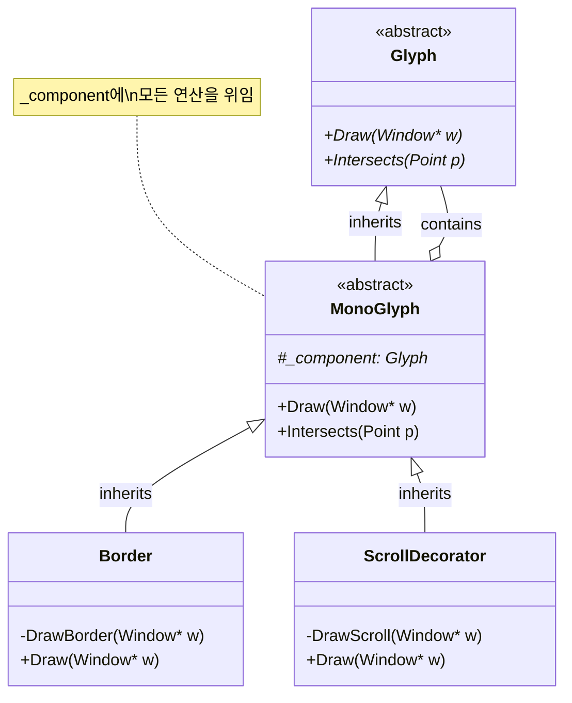

2장은 `Lexi` 라는 이름의 WYSIWYG 편집기를 설계하며 디자인 패턴을 어떻게 대입할지 살펴보는 내용이다.

> 요구사항을 검토하면서 왜 이렇게 쓰였는지를 파악하고, 비슷하게 써보는 게 좋을 것 같다.
> 

# 설계 문제

1. 문서 구조
    1. 문서의 표현방식을 선택할 수 있음. 이는 설계 전반에 모두 영향을 미침
    2. 편집, 서식지정, 표시 및 텍스트 분석은 이것부터 영향을 받음
2. 서식 정하기
    1. 텍스트와 그래픽을 줄과 열로 맞추고, 서식 지정 정책을 어떻게 구성할지?
    2. 문서의 내부구조와 어떻게 상호작용할지?
3. 사용자 인터페이스 꾸미기
    1. 인터페이스가 발전함에 따라 변경가능성이 높음
4. 다양한 룩앤필 지원
    1. 다양한 표준을 지원해야함
5. 다양한 윈도우 시스템 지원
    1. 여러 다른 window system에서 모두 구동해야함 - 시스템 독립적인 구조여야
    (i.e., 맥에서도 리눅스에서도 윈도우에서도)
6. 사용자 조작
    1. 사용자는 버튼, 메뉴 등의 인터페이스로 앱을 제어함
    2. 이 기능은 객체 전체에 흩어져 있음 - 제어에 대한 일관적 메커니즘 제공 필요
7. 맞춤법 검사
    1. 맞춤법 단어 검사 및 (영어 한정) 하이픈(`-`) 처리 분석을 어떻게 지원하는지?
    2. 이런 연산을 추가하기 위해 수정해야하는 클래스 수를 최소화하려면?

각 문제에는 관련된 목표 집합과 이러한 목표를 달성하는 방법에 대한 제약 조건이 있음

구체적인 해결책을 제안하기 전에 목표와 제약 조건에 대해 자세히 설명 (이게 가장 핵심!)

문제와 그 해결책은 하나 이상의 디자인 패턴을 설명 - 각 문제에 대한 논의는 관련 패턴에 대한 간략한 소개로 마무리

# 문서 구조

문서는 결국 문자, 선, 폴리곤, 도형들이 잘 정렬된 것이다. 이런 요소들로 “정보”가 담긴다. 하지만 문서 작성자는 이를 그래픽이 아니라 문서의 물리적 구조(선, 표, 그림, 등의 하위구조)의 관점에서 보기도 한다. 이런 하위구조는 또 하위 구조가 붙는다.

`Lexi` 의 UI는 이런 하위구조를 직접 조작할 수 있어야한다.

- 다이어그램을 그림 덩어리로 보는게 아니라 다이어그램으로 볼 수 있어야 함
- 표를 보더라도 표 자체를 인지할 수 있어야 함

따라서, 문서의 물리적구조와 내부 표현이 일치되는 구조를 잡도록 한다.

내부 표현은 아래를 지원해야한다:

- 문서의 물리적 구조 유지 — 텍스트와 그래픽을 줄, 열, 표 등으로 나열
- 문서를 시각적으로 생성하고 표시
- 디스플레이의 위치를 내부 표현의 요소에 매핑

거기에 더해서 추가 제약사항이 있다.

1. **통합된 처리 메커니즘**: 텍스트와 그래픽을 위한 별도의 시스템을 만들지 않고, 하나의 일관된 메커니즘으로 모든 요소를 처리
2. **계층 구조의 투명성**: 단일 문자든, 복잡한 다이어그램이든, 또는 여러 요소의 그룹이든 상관없이 동일한 방식으로 처리되어야 함
3. **컨텍스트 기반 검증**: 하지만 맞춤법 검사나 하이픈 처리같은 특정 작업들은 요소의 타입에 따라 다르게 처리되어야 함

## 재귀적인 합성

계층적으로 구조화된 정보를 표현하는 일반적인 방법은 재귀적 합성(*recursive composition*)을 활용하는 것.

이점:

- 간단한 요소들로부터 점진적으로 더 복잡한 요소를 만들어내는 방식

이런 게 됩니다:

1. 간단한 그래픽 요소들로 문서를 구성 가능
    1. 문자와 그래픽을 왼쪽에서 오른쪽으로 타일처럼 배열하여 문서의 한 줄 생성 가능
    2. 여러 줄을 배열하여 컬럼을 형성하고
    3. 여러 컬럼으로 페이지를 구성하는 식으로 확장 가능
2. 주요 요소를 객체로 할당해서 무리구조를 표현할 수 있음
    1. 실제 문자, 그래픽 뿐 아니라 공백, 여백 모두 포함
    2. 텍스트, 그래픽을 그리고 서식을 지원 및 상호 삽입 방식을 균일하게 다룰 수 있음
    3. 문자 집합 확장도 가능

이런 어프로치가 끼치는 영향:

1. 객체 각각은 클래스를 가짐
2. 클래스 각각은 호환가능한 인터페이스를 가짐

## Glyphs

책에선 Glyph(”모양” 이라는 단어로 표현할 예정)라는 추상 클래스를 정의한다. 이 추상 클래스는 문서 구조에 나타나는 모든 객체가 해당된다.

이를 구현하는 서브클래스는 두 형태가 존재한다

- 그래픽 요소 (문자, 그림)
- 구조적 요소 (표 등)

`Glyph` 의 주요 책임과 연산은 아래와 같다:

| **Responsibility** | **Operations** | 비고 |
| --- | --- | --- |
| 표현 | `virtual void Draw(Window*)
virtual void Bounds(Rect&)` | 어떻게 그리느냐? |
| 충돌감지 | `virtual bool Intersects(const Point&)` | 얼마만큼의 공간을 차지하느냐? |
| 구조 | `virtual void Insert(Glyph*, int)
virtual void Remove(Glyph*)
virtual Glyph* Child(int)
virtual Glyph* Parent()` | 부모자식 간의 관계를 어떻게 표현하느냐? |

`Glyph` 의 하위 클래스는 `Draw` 연산을 재정의해서 자신을 `Window` 에 렌더한다. `Draw` 연산이 호출될 때 Window 객체의 참조가 전달된다.

`Window` 클래스는 화면의 윈도우에 텍스트와 기본 도형을 렌더링하기 위한 그래픽 연산을 정의한다.

`Rectangle` 클래스(`Glyph`의 서브클래스)는 `Draw` 를 재정의한다.

```cpp
// 멤버변수 x, y축 각각의 값을 가지고 `Rectangle` 을 `Window`에 그리기 위한 연산을 표현함
void Rectangle::Draw (Window* w) {
     w->DrawRect(_x0, _y0, _x1, _y1);
}
```

부모 Glyph는 자식 Glyph가 공간을 차지하는 것도 알아야 한다. `Bounds` 연산은 Glyph가 차지하는 직사각형 영역을 반환한다. 즉, Glyph의 하위 클래스는 이 연산을 재정의하여 자신이 그려지는 직사각형(*Rectangle*)의 영역을 반환한다

`Intersects` 연산은 좌표값이 Glyph와 교차하는지를 리턴한다.

Glyph는 자식을 가질 수 있다. 예를 들어  `Row` 라는 값으로 한 줄의 배열에 다루는 연산으로 `Insert`, `Remove` 가 있다.

`Child` 연산은 자식을 가질 수 있는 Glyph가 자식에 접근할 때 내부적으로 `Child` 를 반드시 거쳐서 연산하게 강제한다. 이러면 데이터 구조가 배열에서 연결 리스트로 변한다고 해도 자식 순회용 `Draw` 연산을 고칠 필요가 없다.

## Composite 패턴

이 예시에는 Composite 패턴이 적합하게 어울린다. 잠재적으로 복잡해질 수 있거나 계층적 구조를 가지는 요소에 사용하면 잘 어울린다.

# 서식 정하기

> 우선 줄바꿈에 한정하여 구성한다
> 

물리적 구조 설계 이후 구체적인 설계를 위해 구체적으로 아래 내용을 다룬다:

1. 텍스트를 어떻게 줄로 나눌지
2. 여백, 들여쓰기, 줄간격 등 사용자의 포맷팅 요구사항을 어떻게 반영할지
3. 이러한 포맷팅 알고리즘을 어떻게 설계할지

그런데 이 설계에는 아래 트레이드오프가 생긴다

- 에디터는 빠릿하면서 서식도 잘 먹혀야한다. 이 둘 사이의 균형을 맞춰야한다
- 하지만 포맷팅 알고리즘은 복잡하므로 문서구조와 최대한 분리시킬 필요가 있다

포맷팅 알고리즘을 지원하는 인터페이스를 만들고, 각 하위 클래스는 이를 수행하기 위한 인터페이스를 구현한다.

`Compositor` 라는 클래스는 이를 캡슐화하기 위한 클래스다. 주요 책임과 연산은 아래와 같다:

| **Responsibility** | **Operations** | 비고 |
| --- | --- | --- |
| 무엇을 포맷팅 할 것인가? | `void SetComposition(Composition*)` |  |
| 어떻게 포맷팅 할 것인가? | `virtual vold Compose()` |  |

이는 앞서 언급한 `Glyph` 의 `Composition` 이라는 하위 클래스에 특정 줄바꿈 알고리즘에 특화된 `Compositor` 의 구현체 클래스 인스턴스를 받는다. 그러면 필요할 때마다 그 `Compositor` (의 concrete class instance) 에게 구성(*Compose*) 하라는 명령을 내린다. 정리하면 아래와 같다:

포매팅 전:

- 순수하게 콘텐츠 Glyph들만 존재 (예: 텍스트, 이미지 등)
- 레이아웃 구조나 배치 정보가 없는 상태
- 마치 한 줄에 모든 내용이 쭉 나열된 것과 같은 상태

포매팅 후:

- 콘텐츠 Glyph들 사이에 Row, Column 같은 구조적 글리프들이 추가됨
- 줄바꿈, 단락 구분 등 시각적 구조가 적용된 상태
- 실제로 사용자에게 보여질 수 있는 레이아웃이 완성된 상태

## Strategy 패턴

- Compositor: 포맷팅 알고리즘이 구현된 “전략(*strategy*)”
- Composition: compositor strategy의 컨텍스트 - 어떻게 유연하게 받아 쓸지에 대한 내용

# 사용자 인터페이스 꾸미기(*Embellishing*)

`Lexi` 의 UI를 꾸미기 위해 여러 구성을 생각할 수 있다. (E.g., 테두리(border), 스크롤바(scroll bars) 등등)

UI 구성은 유연하게 확장되기를 원하며, 동적으로 추가/제거 될 가능성이 크다.

## Transparent enclosure

### 상속보다는 구현을

상속하면? 각 장식 조합마다 새로운 클래스 필요:

- `BorderedComposition`
- `ScrollableComposition`
- `BorderedScrollableComposition`
- 등등... 조합할 수 있는 모든 갯수만큼 “상속”하게 된다!

이른바 투명한 캡슐화는:

- 구조: Border가 Glyph를 포함
- 장점: 기존 클래스 수정 최소화
- 특징: Border도 Glyph의 서브클래스로 구현



여기서의 위임이란?

- MonoGlyph가 받은 모든 요청/연산을
- 자신이 직접 처리하지 않고
- 내부에 저장된 _component 객체에게 그대로 넘겨준다

그리고 동시에 transparent함. `MonoGlyph` 는 자신의 존재를 드러내지 않고 모든 요청을 그대로 외부 컴포넌트에 전달함.

## Decorator 패턴

Decorator 패턴으로…

- 객체에 새로운 책임을 추가하는 모든 형태를 포함
- 다양한 분야에서 적용 가능:
    - 추상 구문 트리 → 의미론적 동작 추가
    - 유한 상태 자동기 → 새로운 전이 추가
    - 영속성 객체 네트워크 → 속성 태그 추가

# 다양한 룩앤필 지원

Lexi의 애플리케이션 외관(look-and-feel)은 아래 설계 목표를 가진다:

- 여러 룩앤필 표준을 지원할 것
- 새로운 표준이 등장했을 때 쉽게 지원을 추가할 수 있을 것
- 궁극적으로는 런타임에서도 룩앤필을 변경할 수 있는 유연성을 확보할 것

여기서는 `Widgets` (이하 위젯)의 룩앤필을 설계한다. 서로 다룬 룩앤필 스타일의 위젯 글리프를 구별할 수 있어야 하고, 이를 생성할 때는 하나의 세트 단위로 쉽게 교체할 수 있어야 한다. 다시말해 객체 생성 프로세스를 추상화 해야한다.

책에서는 `GUIFactory` 라는 위젯 Glyph를 생성하는 추상클래스가 있다. 

팩토리는 서로 관련된 제품(위젯)들을 생성한다.

- 스크롤바, 버튼, 입력 필드, 메뉴 등 동일한 룩앤필의 모든 위젯 생성 가능

그렇다면 `GUIFactory`는 어떻게 관리해야하나?

- **GUIFactory 인스턴스 관리 방법**
    - 전역 변수로 관리
    - 잘 알려진 클래스의 정적 멤버로 관리
    - 지역 변수로 관리 (UI가 하나의 클래스나 함수 내에서 생성되는 경우)
    - Singleton 패턴을 사용하여 관리 가능
- **초기화 시점의 중요성**
    - 위젯 생성 전에 초기화되어야 함
    - 어떤 룩앤필을 사용할지 결정된 후에 초기화되어야 함

## Abstract Factory 패턴

- 하위 제품군을 모두 다루는 특징을 가짐
- 직접적인 클래스 인스턴스화 없이 연관된 제품 객체들의 집합을 생성하는 방법을 제공

# 다양한 윈도우 시스템 지원

`Lexi` 는 다양한 플랫폼에서 실행되어야 함:

- 당시 주요 윈도우 시스템들(Mac, PM, Windows, X)은 서로 호환되지 않음
- 윈도우 시스템은:
    - 비트맵 디스플레이에서 여러 창이 겹쳐 보이는 환경 제공
    - 화면 공간 관리
    - 입력 장치(키보드, 마우스)로부터의 입력을 적절한 창으로 전달

## 이거 날로먹을 수 있는거 아니에요!?

안됩니다.

- Look-and-feel에서는 각 위젯의 공통 추상 클래스(예: ScrollBar)를 만들고 이를 상속받아 구체적인 구현(MotifScrollBar, MacScrollBar)을 할 수 있었음
- 하지만 윈도우 시스템의 경우 이미 각 벤더들이 만든 서로 다른 클래스 계층구조가 존재함
- 이 클래스들은 서로 호환되지 않으며, 공통된 추상 클래스도 없음
- 새로운 윈도우 시스템을 직접 구현하는 것은 현실적으로 불가능함

그러면 어떡해요?

- 모든 윈도우 시스템은 기본적으로 비슷한 기능을 수행함
- Bridge 패턴을 통해 공통된 추상화 계층(abstraction)을 만들고, 각 윈도우 시스템의 구현(implementation)을 이 아래에 연결할 수 있음
- 이렇게 하면 기존 윈도우 시스템의 코드를 그대로 활용하면서도 일관된 인터페이스로 접근 가능

Abstract Factory

- 처음부터 호환되는 클래스 계층구조를 새로 설계할 수 있을 때 유용함

Bridge

- 이미 존재하는 서로 다른 구현체들을 공통된 추상화 계층 아래 통합해야 할 때 더 적합한 패턴

## Bridge 패턴

1. 두 인터페이스의 목적이 다름:
    - Window: 애플리케이션 프로그래머를 위한 인터페이스
    - WindowImp: 실제 window system 구현을 위한 인터페이스
2. 분리의 이점:
    - 두 계층 구조를 독립적으로 발전/개선 가능
    - Window 클래스는 논리적인 창의 개념에 집중
    - WindowImp는 실제 window system의 구현에 집중
    - 서로 영향을 주지 않고 각자의 역할에 맞게 변경/개선 가능

# 사용자 조작

`Lexi` 가 텍스트 에디터로서 역할하려면 아래 동작을 구현해야한다:

1. 인터페이스
    - WYSIWYG 직접 조작: 텍스트 입력/삭제, 커서 이동, 텍스트 선택 등
    - 간접 조작: 풀다운 메뉴, 버튼, 키보드 단축키를 통한 기능
2. 주요 기능
    - 문서 관리: 새 문서 생성, 열기, 저장, 인쇄
    - 편집: 잘라내기, 붙여넣기
    - 서식: 글꼴, 스타일, 정렬, 들여쓰기 변경
    - 기타: 애플리케이션 종료 등

## 요청을 캡슐화

- `MenuItem`은 사용자 요청을 처리하는 Glyph의 하위 클래스
- 각 사용자 요청마다 `MenuItem` 하위 클래스를 만들면?
    - 불필요한 클래스 증가
    - UI와 요청이 강하게 결합됨
- 함수를 파라미터로 사용하면?
    - undo/redo 구현 어려움
    - 상태 관리의 어려움
    - 확장성과 재사용성 부족
- 해결책: 요청을 command 객체로 캡슐화

## 커맨드 클래스와 서브클래스

- 복붙, 폰트, 저장, 종료 등의 커맨드를 `.execute()` 만 실행해서 할 수 있게 분리
- 실행취소, 다시실행 구현이 쉬워짐 - 이전 상태 저장, 명령실행 히스토리 관리에 용이

## 실행취소, 다시실행

실행취소, 되돌리기, 반복가능여부(`Reversible`)이 abstract로 모두 “구현(*implement*)” 가능하게 되어있으면 실제 설계시 써먹을 수 있음

reversible이 구현되어 있으면 `CommandHistory` 를 이용하여 실행된 일련의 커맨드들을 저장할 수 있음.

## Command 패턴

1. 요청의 캡슐화
    - 모든 요청을 Command라는 통일된 인터페이스로 추상화
    - 클라이언트는 구체적인 구현을 알 필요 없이 Command 인터페이스만 알면 됨
    - 실제 구현은 다른 객체들에게 위임 가능
2. 장점:
    - 클라이언트와 구현의 분리
    - 기능 확장이 용이
    - 실행 취소/재실행 기능의 일관된 구현
    - 복잡한 작업의 단순한 인터페이스 제공

# 맞춤법 검사

맞춤법 검사 및 하이픈 추가기능을 설계해야한다.

포맷팅 기능과 비슷한 제약사항이 있다:

- 다양한 알고리즘 지원, 선택가능하게 해야함
- 새 알고리즘을 쉽게 추가할 수 있어야 함
- 하지만 문서구조에 직접적으로 연결되지 않아야 함

tl;dr

- Iterator: 데이터 구조를 어떻게 순회할 것인가
- Visitor: 순회하면서 어떤 처리를 할 것인가

## Iterator 패턴

텍스트 분석은 문자별 검사가 필요함

그런데 Glyph는 연결리스트, 배열, 기타 데이터구조로 저장될 수 있음

역방향 검색을 해야할 수도 있고, 수식의 경우 중위 순회도 할 수 있어야 함

⇒ 내부 구현 노출없이 복잡한 객체구조에 접근 및 순회가 가능함

## Visitor 패턴

텍스트 분석, 맞춤법 검사, 하이픈 삽입 등 다양한 분석 기능이 필요함

그런데 이런 기능을 Glyph 클래스에 직접 구현하면 클래스가 계속 수정되어야 함

또한 향후 문법 검사, 단어 수 계산 등 새로운 분석 기능이 계속 추가될 수 있음

⇒ 문서 구조(Glyph)를 수정하지 않고도 새로운 분석 기능을 추가할 수 있음

# 요약

- Composite (183) - 문서의 물리적 구조를 표현하기 위해
- Strategy (349) - 다양한 포맷팅 알고리즘을 허용하기 위해
- Decorator (196) - 사용자 인터페이스를 꾸미기 위해
- Abstract Factory (99) - 다양한 룩앤필 표준을 지원하기 위해
- Bridge (171) - 다중 윈도잉 플랫폼을 허용하기 위해
- Command (263) - 사용자 작업의 실행 취소를 위해
- Iterator (289) - 객체 구조에 접근하고 순회하기 위해
- Visitor (366) - 문서 구조의 구현을 복잡하게 만들지 않으면서도 무한히 확장 가능한 분석 기능을 허용하기 위해
