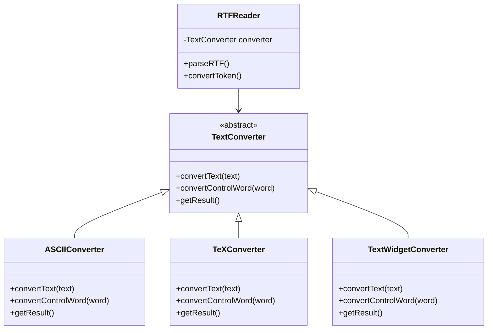
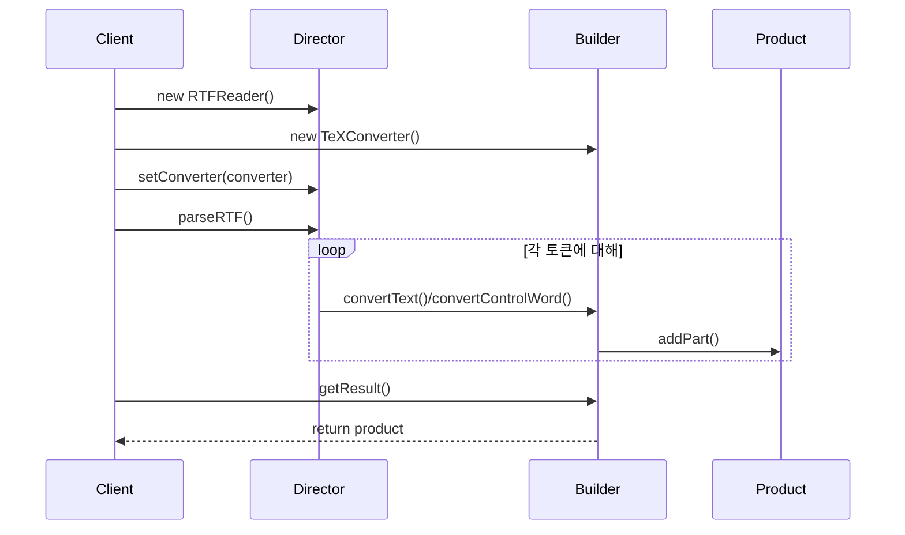

# BUILDER

# Intent

복잡한 객체의 생성 과정(construction)과 표현(representation)을 분리 - 동일한 생성 프로세스로 서로 다른 표현을 만들 수 있습니다

# Motivation

RTF(Rich Text Format) 문서 포맷을 다른 텍스트 형식으로 변환라는 리더가 필요하다고 가정한다. 이 세상에 텍스트 형식은 매우 많으므로 리더를 바구지 않고도 새 변환을 추가할 수 있어야 한다.

- `RtfReader` 클래스에 `TextConverter` 클래스를 구성하고 RTF를 다른 텍스트로 변환.

- `ASCIIConverter`: 일반 텍스트만 변환
- `TeXConverter`: 모든 스타일 정보를 포함한 TeX 표현을 생성
- `TextWidgetConverter`: 사용자가 텍스트를 보고 편집할 수 있는 UI 객체 생성

다시말해, 
- director: `RtfReader`
- builder: 각 변환기 클래스 (`어쩌고Converter`)

이 구조를 사용하면 복잡한 객체 생성, 조립 메커니즘이 추상 인터페이스 뒤에 존재. 변환기는 RTF 문서 파싱을 담당하는 reader와 분리되어있음

# Applicability

- 복잡한 객체를 생성하는 알고리즘이 다음과 독립적이어야 할 때:
    - 객체를 구성하는 부분들
    - 부분들이 조립되는 방식
- 생성 과정에서 생성되는 객체의 다양한 표현이 필요할 때

# Structure

[^1]

# Participants

- Builder(`TextConverter`)
    - Product 객체의 부분들을 생성하기 위한 추상 인터페이스
- Concrete Builder (E.g., `ASCIIConverter`, `TeXConverter`, `TextWidgetConverter`)
    - Builder 인터페이스를 구현하여 제품의 부분들을 구성하고 조립
    - 자신이 생성하는 표현을 정의하고 관리
    - 제품을 가져오기 위한 인터페이스 제공 (`GetASCIIText`, `GetTextWidget` 등)
- Director (`RTFReader`)
    - Builder 인터페이스를 이용해 객체 생성
- Product (`ASCIIText`, `TeXText`, `TextWidget`)
    - 생성 중인 복잡한 객체를 표현
        - Concrete Builder가 제품의 내부 표현을 구축하고 조립 과정 정의
    - 구성 요소를 정의하는 클래스들과 최종 결과물로 조립하는 인터페이스 포함

# Collaborations

1. 클라이언트가 Director 객체를 생성하고 원하는 Builder 객체로 구성
1. Director는 제품의 부분을 생성해야 할 때마다 builder에게 알림
1. Builder는 director의 요청을 처리하고 제품에 부분을 추가
1. 클라이언트는 builder로부터 제품을 가져옴

# Consequences

1. 제품의 내부 표현 변경 가능
    - Builder는 director에게 제품 생성을 위한 추상 인터페이스 제공
    - 제품의 표현과 내부 구조를 숨김
    - 새로운 builder를 정의하는 것만으로 제품의 내부 표현 변경 가능
1. 생성과 표현 코드 분리
    - 복잡한 객체의 생성과 표현 방식을 캡슐화하여 모듈성 향상
    - 클라이언트는 제품의 내부 구조를 알 필요 없음
    - 각 ConcreteBuilder는 특정 제품 생성/조립 코드를 포함
    - 여러 Director가 동일한 부품으로 다양한 제품 생성 가능 (예: SGMLReader가 TextConverter 재사용) (SGML이란?[^2])
1. 생성 과정의 세밀한 제어
    - 다른 생성 패턴과 달리 단계별 생성 가능
    - Director의 통제 하에 제품이 완성된 후에만 builder에서 제품 받음
    - Builder 인터페이스가 제품 생성 과정을 더 잘 반영
    - 생성 과정과 결과물의 내부 구조를 더 세밀하게 제어

# Implementation

추상 Builder 클래스는 director가 요청할 수 있는 각 컴포넌트 별 빈 메소드를 정의
Concrete builder는 필요한 컴포넌트 생성 메서드만 오버라이드.

## 구현 시 고려사항

1. 조립과 생성 인터페이스
    - Builder 인터페이스는 모든 concrete builder의 제품 생성을 지원할 만큼 일반적이어야 함
    - 일반적으로 생성 요청 결과를 제품에 추가하는 모델이면 충분 (RTF 예시)
    - 이전 생성 부분 접근이 필요한 경우도 있음 (미로의 문 연결, 파스 트리 등)
2. 제품의 추상클래스가 없는 이유?
    - concrete builder가 만드는 product는 표현이 매우 다름
    - 공통 부모클래스의 이점이 적음
    - 클라이언트가 사용중인 builder를 알고 있기때문에 제품 처리 가능
3. Builder의 empty method
    - 클라이언트가 필요한 연산만 오버라이드 하도록 구현

# Known Usages

# Related Patterns

- Abstract Factory:
    - Builder의 관심사: 복잡한 객체를 단계별로 생성, 반환
    - Abstract Factory의 관심사: 완성된 최종 결과물을 바로 반환
- Composite: Builder가 자주 생성하는 대상

[^1]: 출처는 여기입니다! [refactoring.guru - Builder](https://refactoring.guru/design-patterns/builder)
[^2]: https://en.wikipedia.org/wiki/Standard_Generalized_Markup_Language
