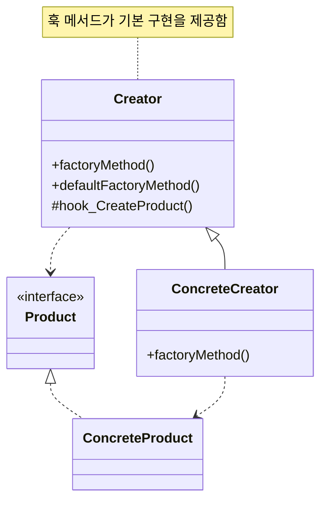
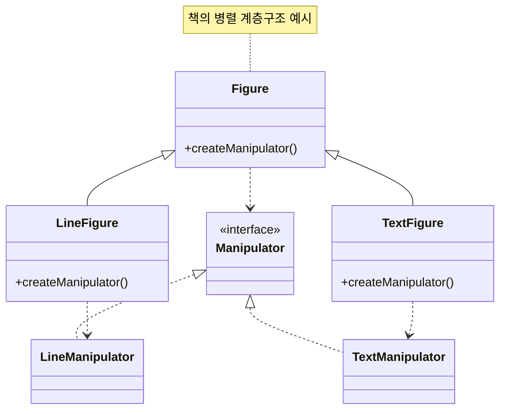

# FACTORY METHOD

# Intent

객체를 생성하기 위한 인터페이스를 정의하되, 어떤 클래스를 인스턴스화할지는 서브클래스가 결정하도록 한다. Factory Method는 클래스의 인스턴스화를 서브클래스로 미룬다.

# aka.

Virtual Constructor

# Motivation

예를들어 여러 문서를 표시할 수 있는 애플리케이션용 프레임워크를 생각해보자.

`Application`: 은 문서 관리 애플리케이션의 뼈대(추상화), 문서를 생성하고 관리하는 전반적인 책임을 가짐
`Document` 는 모든 종류의 문서(텍스트 문서, 그림 문서 등)에 대한 추상화입니다.

Factory Method 패턴은:

1. `Application` 클래스에 `createDocument()` 라는 추상 메서드를 선언
2. 구체적인 애플리케이션 클래스(예: `DrawingApplication`, `TextApplication`)에서 이 메서드를 재정의
3. 각 구체 클래스는 자신에게 맞는 특정 `Document` 서브클래스(예: `DrawingDocument`, `TextDocument`)를 생성하는 책임을 가짐

문서 생성 로직을 프레임워크로부터 분리하고, 새로운 종류의 문서 지원이 필요할 때 기존 코드를 수정하지 않고도 확장할 수 있음.

# Applicability

아래 상황에 적합하다:

- 클래스가 자신이 생성해야 하는 객체의 클래스를 예측할 수 없을 때
- 클래스가 자신의 서브클래스에게 생성할 객체를 명시하게 하고 싶을 때
- 클래스가 여러 보조 서브클래스 중 하나에게 책임을 위임하고, 어떤 보조 서브클래스가 위임자인지에 대한 지식을 국소화하고 싶을 때
    - 객체 생성 책임을 특정 서브클래스에 집중시킴
    - 이 정보를 한 곳에서만 관리

# Structure


# Participants

- _Product_ (`Document`)
    - 팩토리 메서드가 생성하는 객체의 인터페이스를 정의
- _ConcreteProduct_ (`MyDocument`)
    - Product 인터페이스를 구현
- _Creator_ (`Application`)
    - Product 타입의 객체를 반환하는 팩토리 메서드를 선언
    - Creator는 기본 ConcreteProduct 객체를 반환하는 팩토리 메서드의 기본 구현을 정의할 수도 있음
    - Product 객체를 생성하기 위해 팩토리 메서드를 호출할 수 있음
- _ConcreteCreator_ (`MyApplication`)
    - ConcreteProduct의 인스턴스를 반환하도록 팩토리 메서드를 재정의

# Collaborations

`Creator`는 적절한 `ConcreteProduct`의 인스턴스를 반환하기 위해 자신의 서브클래스들이 팩토리 메서드를 정의하는 것에 의존함

- `Creator`(예: `Application`)는 실제 객체 생성을 직접 하지 않음
- 대신 자신의 서브클래스(예: `MyApplication`)에게 이 책임을 위임
- 서브클래스는 팩토리 메서드를 구현하여 적절한 `ConcreteProduct`(예: `MyDocument`)를 생성

# Consequences

## 주요 장단점[^1]

1. 주요 장점
    1. 애플리케이션별 클래스들을 코드에 직접 바인딩할 필요가 없어짐
       코드는 오직 `Product` 인터페이스만 다루므로, 어떤 사용자 정의 `ConcreteProduct` 클래스와도 동작 가능
2. 잠재적 단점
    1. "클라이언트가 특정 `ConcreteProduct` 객체를 생성하기 위해 `Creator` 클래스를 서브클래싱해야 할 수 있음
    2. 클라이언트가 어차피 `Creator` 클래스를 서브클래싱해야 하는 경우라면 괜찮지만, 그렇지 않다면 클라이언트는 또 다른 변경 지점을 다뤄야 함

## 개선안

훅(Hook) 메서드 활용

- 기본 구현을 제공하는 팩토리 메서드를 만들 수 있음
- 필요한 경우에만 서브클래스에서 재정의하여 사용
- 예: Document 클래스의 `CreateFileDialog`

병렬 클래스 계층구조 활용

- 관련된 클래스들 간의 계층구조를 효과적으로 관리
- 예: Figure-Manipulator 관계처럼 서로 연관된 클래스들의 생성과 관리를 체계적으로 할 수 있음
    - 병렬적 구조로 되어있고, 각 요소를 동시생성할 수 있는 `manipulator`를 만들고
    - 필요하면 그걸 쓴다
- 각 클래스의 책임을 명확히 분리하면서도 연결성 유지 가능(필요하면 같이 쓸 수 있다)





# Implementation

1. Creator가 추상 클래스인 경우
    - 팩토리 메서드의 구현을 제공하지 않음
    - 서브클래스가 반드시 구현을 정의해야 함
    - 예측할 수 없는 클래스들의 인스턴스화 문제를 해결할 때 유용
2. Creator가 구체 클래스인 경우
    - 팩토리 메서드의 기본 구현을 제공
    - 주된 목적은 유연성 확보
    - "객체 생성을 별도 작업으로 분리하여 서브클래스가 생성 방식을 변경할 수 있게 하라"는 규칙을 따름
    - 서브클래스가 필요할 때 부모 클래스의 객체 생성 방식을 변경할 수 있음

# Sample Code

> - `src`, `test` 디렉터리의 파일을 참고 부탁드립니다.
> - 커밋 이력을 통해 코드를 어떻게 리팩터 했는지 참고하시면 좋습니다.
> - 테스트는 루트 디렉터리의 `README.md` 파일의 가이드를 따라하시면 구동하실 수 있습니다.

1. MazeGame은 미로를 만드는 전체 알고리즘을 정의하지만, 구체적인 구성 요소(방, 벽, 문 등)의 생성은 서브클래스에 위임
2. 각 Factory Method(make_maze(), make_room(), make_door(), make_wall())는 서브클래스에서 구현됨

## Abstract Factory와의 주요 차이점?

- 생성 로직이 게임 클래스 자체에 포함되어 있음
- 객체 생성 책임이 별도의 팩토리 클래스가 아닌 게임 클래스의 서브클래스에 있음
- 미로 생성 알고리즘의 뼈대(create_maze())가 기본 클래스에 정의되어 있음

# Known usages

현대 예시를 들자면...

DB 커넥션 맺기

```python
class DBConnection:
    @abstractmethod
    def connect(self):
        pass


class MySQLConnection(DBConnection):
    def connect(self):
        return mysql.connector.connect(...)


class PostgreSQLConnection(DBConnection):
    def connect(self):
        return psycopg2.connect(...)


class ConnectionFactory:
    @staticmethod
    def create_connection(db_type: str) -> DBConnection:
        if db_type == "mysql":
            return MySQLConnection()
        elif db_type == "postgresql":
            return PostgreSQLConnection()
```

# Related patterns

- 추상 팩토리
    - 추상 팩토리는 여러 개의 팩토리 메서드를 포함하는 더 큰 범위의 패턴
    - E.g., UI 테마를 만드는 추상 팩토리는 버튼, 체크박스, 라디오 버튼 등을 만드는 여러 팩토리 메서드를 포함할 수 있음
- 템플릿 메서드
    - 알고리즘의 뼈대를 정의하고, 일부 단계를 하위 클래스에 위임
    - 이때 객체 생성 단계를 팩토리 메서드로 구현하는 것이 일반적
- 프로토타입
    - 프로토타입은 기존 객체를 복제하는 방식으로 새 객체를 생성
    - 팩토리 메서드와 달리 하위 클래스가 필요 없지만, 대신 초기화 과정이 필요할 수 있음
    - 팩토리 메서드는 새로운 인스턴스를 직접 생성하므로 별도의 초기화 과정이 필요 없음

[^1]: 여기서는 직접적으로 장단점을 이야기하므로 언급하기로 함

