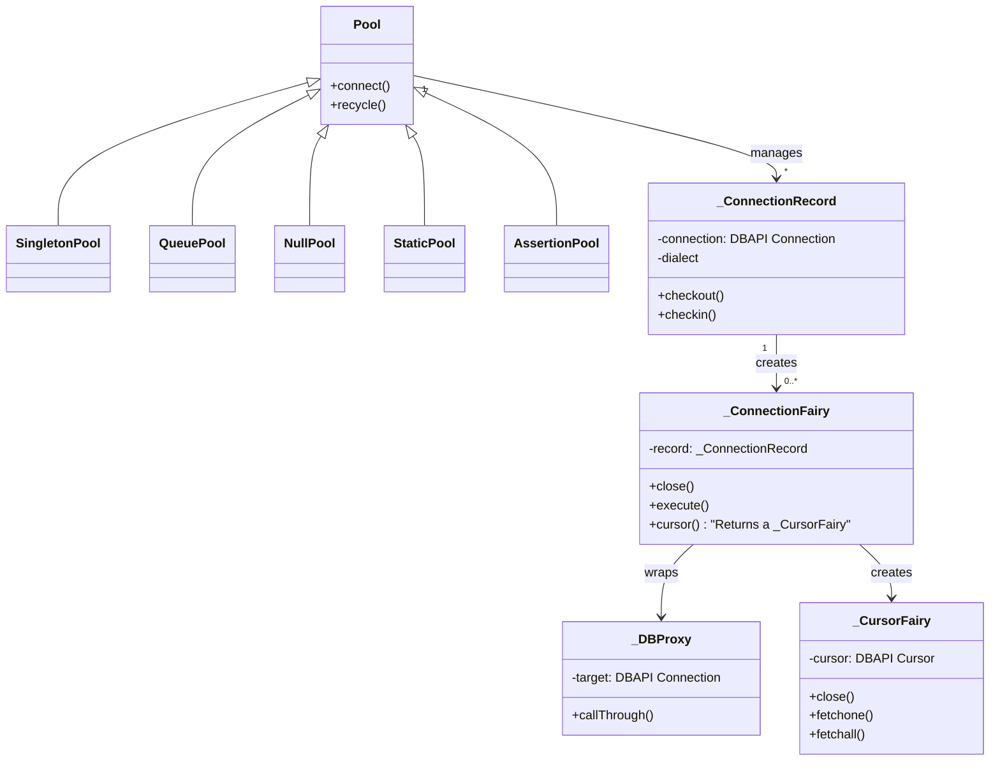

# PROTOTYPE

# Intent

원형이 되는 인스턴스를 사용하여 생성할 객체의 종류를 명시하고, 이 원형을 복사하여 새로운 객체를 생성

# Motivation

클래스 폭발을 막기 위함

- 가정
    - 그래픽 편집기 프레임워크를 기반으로 음악 악보 편집기를 만들고자 함
    - 음표, 쉼표, 악보선 등의 음악 객체들을 추가해야 함
    - 도구 팔레트를 통해 이러한 객체들을 생성하고 조작할 수 있음
- 프레임워크 구조
    - `Graphic`: 그래픽 컴포넌트를 위한 추상 클래스
    - `Tool`: 도구를 정의하기 위한 추상 클래스
    - `GraphicTool`: 그래픽 객체를 생성하는 도구 클래스
- 직면한 문제
    - `GraphicTool`은 프레임워크에 속하지만, 음악 관련 클래스들은 애플리케이션에 특화됨
    - `GraphicTool`이 음악 객체들을 어떻게 생성해야 할지 모름
    - 각 음악 객체마다 `GraphicTool`을 상속받아 구현하면 너무 많은 서브클래스가 생김
- Prototype 패턴을 통한 해결
    - `GraphicTool`이 `Graphic` 인스턴스를 복제("clone")하여 새로운 객체를 생성
    - 각 `GraphicTool`은 복제할 prototype으로 초기화됨
    - `Graphic` 서브클래스들이 Clone 연산을 지원하면 됨
- 추가적인 최적화
    - 온음표와 2분음표를 별도의 클래스로 만들 필요 없음
    - 대신 같은 `MusicalNote` 클래스의 인스턴스에 다른 비트맵과 지속시간을 설정
    - 이를 통해 클래스 수를 대폭 줄일 수 있음
    - 새로운 종류의 음표 추가도 더 쉬워짐

# Applicability

- 시스템이 제품들이 어떻게 생성되고, 구성되고, 표현되는지와 독립적이어야 할 때
- 인스턴스화할 클래스들이 실행 시간에 결정될 때 (예: 동적 로딩을 통해)
- 제품들의 클래스 계층구조와 병행하는 팩토리들의 클래스 계층구조를 만드는 것을 피하고 싶을 때
- 클래스의 인스턴스들이 서로 다른 상태의 조합을 몇 가지로만 가질 수 있을 때
    - 이런 경우 매번 적절한 상태로 수동으로 클래스를 인스턴스화하는 것보다, 해당하는 수의 프로토타입들을 미리 만들어두고 이를 복제하는 것이 더 편리할 수 있음

# Structures


# Participants

- _Prototype_ (예: `Graphic`)
    - 자신을 복제하기 위한 인터페이스를 선언
- _ConcretePrototype_ (예: `Staff`, `WholeNote`, `HalfNote`)
    - 자신을 복제하기 위한 연산을 구현
- _Client_ (예: `GraphicTool`)
    - prototype에게 자신을 복제하도록 요청하여 새로운 객체를 생성

# Collaborations

- Client는 Prototype에게 자기 자신을 `clone` 요청한다

# Consequences

1. 런타임에 제품을 추가/제거 가능
    - Motivation 예시: 새로운 음표 타입이 필요할 때, `MusicalNote` 클래스의 새로운 인스턴스를 prototype으로 등록하기만 하면 됨
    - 코드 수정 없이 런타임에 새로운 음표 타입 추가 가능
2. 값을 변경하여 새로운 객체 명세
    - Motivation 예시: 하나의 `MusicalNote` 클래스로 온음표, 2분음표 등을 비트맵과 지속시간만 다르게 설정하여 생성
    - 새로운 클래스를 만들지 않고도 객체의 상태값만 변경하여 다양한 음표 표현 가능
3. 구조를 변경하여 새로운 객체 명세
    - Motivation 예시: 악보는 여러 음표, 쉼표, 악보선 등이 조합된 복합 구조
    - 이러한 복합 구조도 하나의 prototype으로 등록하여 재사용 가능
4. 서브클래싱 감소
    - Motivation의 문제점: "각 음악 객체마다 `GraphicTool`을 상속받으면 너무 많은 서브클래스가 생김"
    - 해결: prototype 패턴을 사용하면 `GraphicTool` 하나로 여러 종류의 음표를 생성 가능
5. 동적 애플리케이션 구성
    - Motivation 예시: 프레임워크(`GraphicTool`)와 애플리케이션 특화 클래스들(`MusicalNote` 등) 분리
    - 음악 관련 클래스들을 동적으로 로드하고 prototype으로 등록 가능

## 한계점과 Motivation의 연관성

- 각 서브클래스가 Clone을 구현해야 함 → 모든 음악 객체 클래스(`MusicalNote`, `Staff` 등)가 Clone 메서드를 구현해야 함
- 복잡한 객체의 Clone 구현이 어려움 → 예를 들어, 전체 악보를 복제할 때 내부의 모든 음표, 쉼표 등을 올바르게 복제해야 하는 문제 발생

# Implementation

1. Prototype 관리자 (Registry) 사용
    - 동적으로 prototype을 관리할 때 필요
    - 키-값 형태로 prototype을 저장하고 검색하는 시스템
    - 런타임에 시스템 확장 가능
2. Clone 연산의 올바른 구현
    - 얕은 복사 vs 깊은 복사 문제
    - 순환 참조 처리
    - 언어별 기본 제공 기능의 한계
    - Save/Load를 통한 대안적 구현 방법
3. 복제본 초기화 방법
    - Clone 시점의 매개변수 전달의 한계
    - 별도의 Initialize 연산 필요성
    - 메모리 관리 주의사항

# Sample Code

> - `src`, `test` 디렉터리의 파일을 참고 부탁드립니다.
> - 커밋 이력을 통해 코드를 어떻게 리팩터 했는지 참고하시면 좋습니다.
> - 테스트는 루트 디렉터리의 `README.md` 파일의 가이드를 따라하시면 구동하실 수 있습니다.

# Known Usages

- 객체 풀 생성? - 그렇다면 SQLAlchemy의 Pool이 Prototype을 쓰는지 살펴봅시다.

## `Pool` 객체란?

- [DB-API 2.0](https://peps.python.org/pep-0249/) 스펙에 맞는 `connect()` 구현체에 대해 커넥션 풀 구현을 제공합니다.



# Related Patterns

1. Prototype vs Abstract Factory
    - 둘 다 객체 생성을 다루는 생성 패턴이라 경쟁 관계
    - 하지만 결합도 가능
        ```python
        class AbstractFactory:
            def __init__(self, prototype_a, prototype_b):
                self.prototype_a = prototype_a  # 프로토타입 저장
                self.prototype_b = prototype_b
        
            def create_product_a(self):
                return self.prototype_a.clone()  # 프로토타입에서 복제
        ```
2. Composite 패턴과의 관계
    - Composite: 객체들의 트리 구조를 표현
    - 예시: 음악 편집기에서 전체 악보(복잡한 구조)를 프로토타입으로 저장하고 재사용
3. Decorator 패턴과의 관계
    - Decorator: 객체에 동적으로 책임 추가
    - 예시: 특정 스타일이 적용된 UI 컴포넌트를 프로토타입으로 저장하고 재사용
  