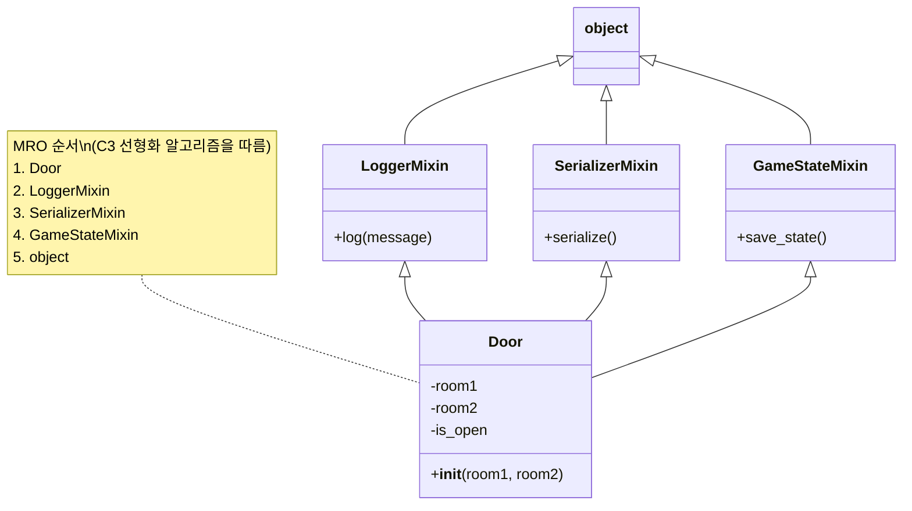

# 구조 패턴

클래스와 객체들이 더 큰 구조를 형성하기 위해 어떻게 구성되는지를 다룬다.

크게 두 가지가 있다:

- 구조적 클래스 패턴 - 상속을 사용하여 인터페이스/구현을 구성
    - 다중상속으로 두 클래스를 하나로 혼합 - (파이썬이라면 믹스인(_mixin_)같은 개념[^1]이 있을 것이고)
    - 독립적으로 개발된 클래스 라이브러리들을 함께 작동하게 만드는 데 특히 유용
    - 서로 다른 인터페이스 간의 통일된 추상화를 제공하기 위해, 적응대상 클래스를 비공개로 상속받아 새로운 인터페이스에 맞춰 구현
- 구조적 객체 패턴 - 새 기능을 구현하기 위해 객체를 조합하는 방법을 설명함
    - 객체 합성을 사용하여 새로운 기능을 추가 -> 유연함 획득 가능

## 종류

- 구조적 클래스 패턴(상속 기반)
    - ADAPTER (클래스 버전) - 상속을 통해 인터페이스를 변환
    - BRIDGE - 추상화/구현의 분리를 상속으로 구현
- 구조적 객체 패턴(객체 구성 기반)
    - ADAPTER (객체 버전) - 객체 합성을 통해 인터페이스 변환
    - COMPOSITE - 객체들을 트리 구조로 구성
    - DECORATOR - 동적으로 책임 추가
    - FAÇADE - 서브시스템을 단순화
    - FLYWEIGHT - 객체 공유로 세밀한 객체 지원
    - PROXY - 객체를 위한 대리자나 자리표시자

## 간단요약

1. **Composite**: 기본 객체와 복합 객체를 동일하게 다룰 수 있는 트리 구조를 구성하는 패턴.
1. **Proxy**: 다른 객체에 대한 대리자나 자리표시자 역할을 하여 접근을 제어하는 패턴.
1. **Flyweight**: 많은 수의 작은 객체들을 공유하여 메모리 사용을 최적화하는 패턴.
1. **Facade**: 복잡한 서브시스템에 대한 단순화된 통합 인터페이스를 제공하는 패턴.
1. **Bridge**: 추상화와 구현을 분리하여 독립적인 변화를 가능하게 하는 패턴.
1. **Decorator**: 객체에 동적으로 새로운 책임이나 기능을 추가할 수 있게 하는 패턴.
1. **Adapter**: 호환되지 않는 인터페이스를 가진 클래스들이 함께 동작할 수 있도록 변환하는 패턴.

[^1]: Appendix I 참고

---

# Appendix I - MRO

## MRO (Method Resolution Order) 란?

MRO는 파이썬의 다중상속 해결을 위한 방법이다. 파이썬 2.3때 소개되었으며, 아직도 쓰인다.

### MRO의 필요성

다중상속의 장점을 활용하면서 일반적인 다중상속의 복잡성을 줄일 수 있다.

```python
class LoggerMixin:
    def log(self, message):
        print(f"[LOG] {self.__class__.__name__}: {message}")


class SerializerMixin:
    def serialize(self):
        return {
            attr: getattr(self, attr)
            for attr in self.__dict__
            if not attr.startswith('_')
        }


class Room(LoggerMixin, SerializerMixin):
    def __init__(self, room_no):
        self.room_no = room_no
        self.sides = [None] * 4

    def set_side(self, direction, map_site):
        self.sides[direction.value] = map_site
        self.log(f"Side {direction.name} set to {map_site.__class__.__name__}")
```

### MRO 알고리즘

> [!TIP]
> 보다 정확한 내용은 아래 주소를 참고하세요.
>
> [(Python 2.3) Method Resolution Order](https://docs.python.org/3/howto/mro.html)

이를 위해
내부적으로 [C3 선형화 알고리즘](https://en.wikipedia.org/wiki/C3_linearization)을 사용하며 이는 객체지향 프로그래밍에서 다중 상속 시 메서드 호출 순서를
결정하는 알고리즘이다. 알고리즘의 특징은:

- 단조성(_monotonicity_) 보장: 만약 클래스 A가 클래스 B보다 먼저 탐색된다면, 이 순서는 모든 하위 클래스에서도 유지됨
- 지역 우선 순위(_local precedence_) 보존: 부모 클래스들의 선언 순서가 중요하며, 왼쪽에서 오른쪽으로의 순서가 유지됨

## MRO 예시

### MRO 알고리즘 이해하기

`test/appendix01/mixin_example01.py` 파일을 통해 실제로 구동한 순서는 아래와 같다



### MRO 실?전 예시

`test/appendix01/mixin_example02.py` 파일은 아래 의미를 가진다:

- `LoggerMixin`:
    - 타임스탬프와 함께 로그를 출력
    - 로그 레벨 지원 (INFO, WARNING 등)
    - UserAccount 클래스에서 계정 생성과 이메일 변경 추적에 사용
- `SerializerMixin`:
    - 객체를 딕셔너리나 JSON으로 변환
    - Product 클래스에서 상품 정보를 직렬화하는데 사용
    - API 응답이나 데이터 저장에 유용
- `GameStateMixin`:
    - 게임 상태 저장과 복원 기능
    - `SerializerMixin에` 의존하여 상태를 직렬화
    - LoggerMixin과 함께 사용하여 상태 변경을 로깅

테스트로 아래 내용을 테스트한다:

**Fixtures 활용**:

- 각 테스트에서 사용할 객체들을 fixture로 정의
- 코드 중복을 줄이고 테스트 설정을 일관되게 유지

**Mock 사용**:

- `unittest.mock.patch`를 사용하여 print 함수를 모킹
- 로그 출력을 캡처하고 검증 가능

**freezegun**:

- 시간 관련 테스트를 위해 freezegun 라이브러리 사용
- 타임스탬프가 포함된 로그를 정확히 테스트 가능

**테스트 구조**:

- 각 믹스인별로 별도의 테스트 클래스
- 통합 테스트를 위한 별도 클래스
- 각 테스트는 하나의 기능만 검증

**예외 테스트**:

- `pytest.raises`를 사용하여 예외 발생 검증
- 잘못된 상태 로딩 시 적절한 예외 발생 확인
