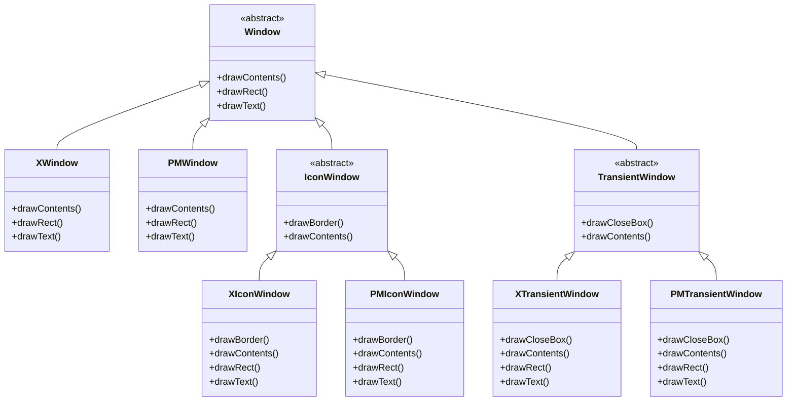
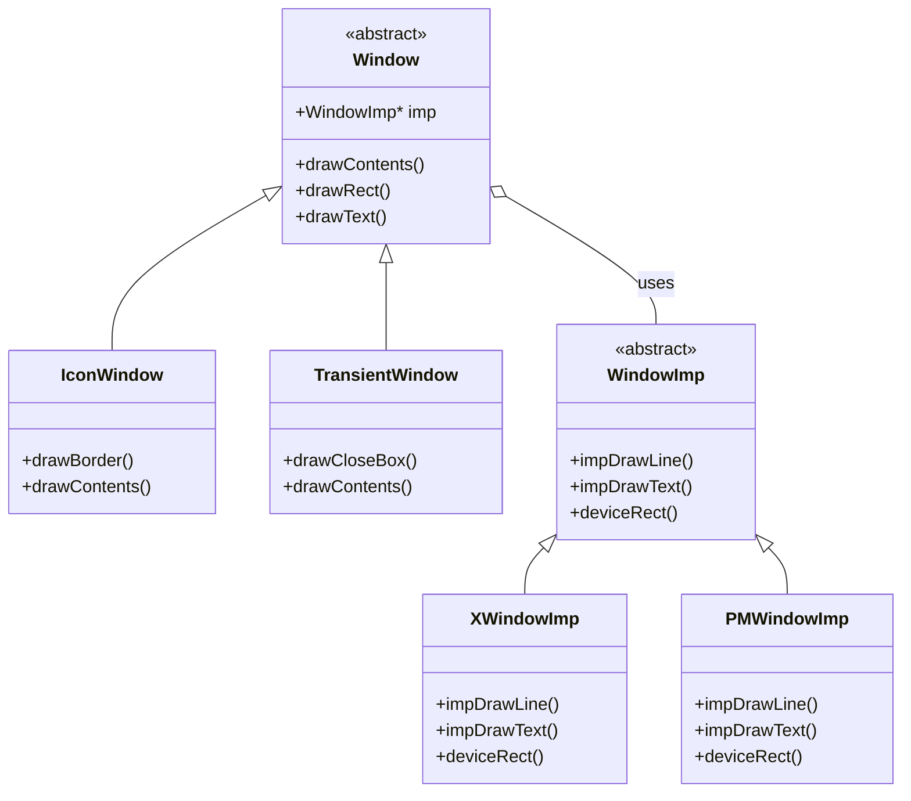

# BRIDGE

# Intent

추상화(abstraction)와 구현(implementation)을 분리하여 각각 독립적으로 변화할 수 있게 하는 것

# aka.

Handle/Body

# Motivation

하나의 추상화가 여러 구현을 가질 수 있는 경우, 일반적으로는 상속으로 처리한다.
그러나 상속은 추상화와 구현을 강하게 결합시키므로, 추상화나 구현 중 하나가 변경되면 다른 하나도 변경되어야 한다.
이는 추상화와 구현을 독립적으로 확장하거나 변경할 수 없게 한다.

## Window를 그리는 예제 - 단점에 집중

- 클래스 폭발: 새로운 윈도우 타입이나 플랫폼이 추가될 때마다 많은 수의 새로운 클래스가 필요
- 코드 중복: 각 플랫폼별 구현에서 비슷한 코드가 반복됨
- 확장의 어려움: 새 플랫폼 추가 시 모든 윈도우 타입에 대한 구현이 필요



## Bridge 패턴 적용

> ![TIP]
> 추상화-구현이라는 개념을 확장한다.
>
> 큰 개념 추상화, 작은개념 추상화(근데 인터페이스로 주입받을 수 있게)로 푼다

1. "큰 개념 추상화" (High-level abstraction):
    - 사용자가 실제로 사용하는 인터페이스를 정의
    - 예: `Window`라는 개념

2. "작은 개념 추상화" (Low-level abstraction):
    - "큰 개념 추상화"를 구현하기 위한 인터페이스를 정의
    - 예: `WindowImp`라는 개념



정리:

- 의존성 주입을 통한 결합도 낮춤
- 각 계층이 독립적으로 변경 가능
- 새로운 구현체 추가가 용이 (예: `LinuxWindowImp`, `WaylandWindowImp` 등)

# Applicability

"추상화와 구현의 분리"라는 핵심 아이디어가 절실히 필요할 때. 시스템의 확장성과 유연성을 챙겨야한다면 고려해봄직 하다.

이럴 때 사용하면 좋다:

1. 추상화와 구현의 영구적 결합을 피하고 싶을 때
2. 추상화와 구현 모두를 서브클래싱으로 확장해야 할 때
3. 구현 변경이 클라이언트에 영향을 주지 않아야 할 때
4. 구현을 클라이언트로부터 완전히 숨기고 싶을 때[^1]
5. 클래스가 과도하게 증식될 때
6. 여러 객체 간에 구현을 공유하고 싶을 때

# Structure


# Participants

1. Abstraction (`Window`)
    - 추상화의 인터페이스를 정의
    - Implementor 타입의 객체에 대한 참조를 유지
2. RefinedAbstraction (`IconWindow`)
    - Abstraction이 정의한 인터페이스를 확장
    - 추가적인 기능이나 변형된 기능을 제공
3. Implementor (`WindowImp`)
    - 구현 클래스들을 위한 인터페이스 정의
    - Abstraction의 인터페이스와 정확히 일치할 필요 없음
    - 일반적으로 더 primitive한 연산들을 제공
4. ConcreteImplementor (`XWindowImp`, `PMWindowImp`)
    - Implementor 인터페이스를 구현하고 구체적인 구현을 정의

# Collaborations

Abstraction은 클라이언트 요청을 Implementor 객체로 전달함.

# Consequences

시스템의 유연성과 재사용성을 크게 향상시키며,
특히 크로스 플랫폼 애플리케이션이나 다양한 구현을 지원해야 하는 시스템에서 매우 유용

1. 인터페이스와 구현의 분리
    - 구현이 인터페이스에 영구적으로 묶이지 않음
    - 추상화의 구현을 런타임에 구성 가능
    - 객체가 런타임에 구현을 변경하는 것도 가능
2. 확장성 향상
    - Abstraction과 Implementor 계층을 독립적으로 확장 가능
3. 클라이언트로부터 구현 세부사항 숨김
    - 구현자 객체의 공유나 참조 카운트 메커니즘 같은 구현 세부사항을 클라이언트로부터 숨길 수 있음

# Implementation

Bridge 패턴을 도입할 땐 아래와 같은 구현 이슈를 고려해보시오

1. 단일 구현체만 있으면 BRIDGE는 과도하다
2. FACTORY 패턴과 잘못 결합하면 곤란하다
3. 불필요하게 다중상속을 할 필요가 없다

# Sample Code

`bridge/src`, `bridge/test` 참조

# Known usages

1. 다중 DB 지원 시스템? [^2]

```python
# 큰 개념 추상화: Repository
class UserRepository:
    def __init__(self, db: Database):
        self._db = db

    def save_user(self, user):
        # 어떤 DB를 쓰든 동일한 방식으로 저장
        self._db.begin_transaction()
        self._db.insert(user)
        self._db.commit()


# 작은 개념 추상화: Database
class Database(Protocol):
    def begin_transaction(self): ...

    def insert(self, data): ...

    def commit(self): ...


# 구체적인 구현
class PostgreSQL(Database):
    def insert(self, data):
        # PostgreSQL 특화 구현
        pass


class MongoDB(Database):
    def insert(self, data):
        # MongoDB 특화 구현
        pass
```   

2. 멀티 플랫폼 push system?

```python
# 큰 개념 추상화: 알림 발송기
class NotificationSender:
    def __init__(self, platform: NotificationPlatform):
        self._platform = platform

    def send_notification(self, user, message):
        self._platform.initialize()
        self._platform.push_message(user, message)
        self._platform.finalize()


# 작은 개념 추상화: 플랫폼
class NotificationPlatform(Protocol):
    def initialize(self): ...

    def push_message(self, user, message): ...

    def finalize(self): ...


# 구체적인 구현
class FCM(NotificationPlatform):  # Firebase Cloud Messaging
    def push_message(self, user, message):
        # Google FCM 특화 구현
        pass


class APNS(NotificationPlatform):  # Apple Push Notification Service
    def push_message(self, user, message):
        # Apple APNS 특화 구현
        pass
```

# Related patterns

- BRIDGE 패턴은 설계 시점에 "의도적으로" 추상화와 구현을 분리
- ADAPTER 패턴은 이미 만들어진 시스템들을 "사후에" 연결
- 추상 팩토리는 BRIDGE 패턴에서 필요한 구현체들을 생성하는 역할을 맡을 수 있음

[^1]: https://en.cppreference.com/w/cpp/language/pimpl<br />https://hodongman.github.io/2020/02/15/C++-Pimpl.html
[^2]: 추후 SQLAlchemy 코드를 본다거나 하면 좋을듯?
