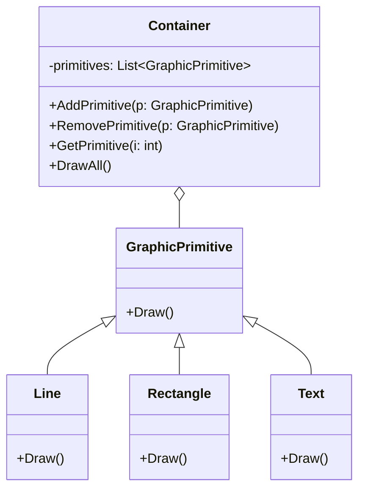
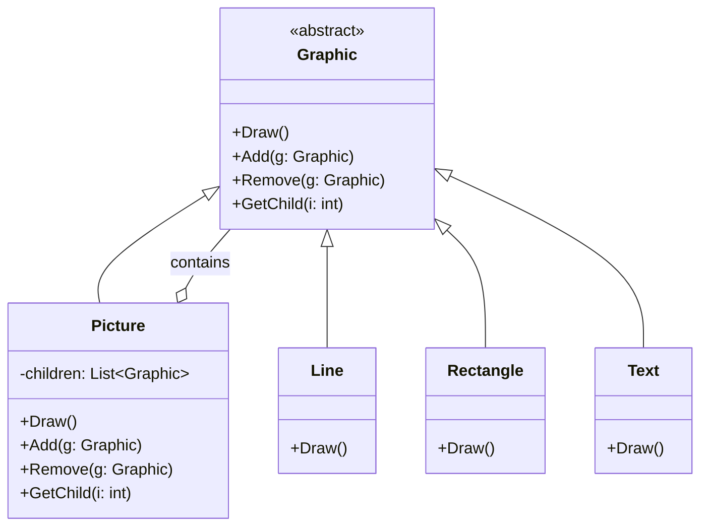

# COMPOSITE

# Intent

객체들을 트리 구조로 구성하여 부분-전체 계층구조를 표현

클라이언트는 개별 객체와 객체들의 집합을 동일하게 다룰 수 있음

# Motivation

그래픽 애플리케이션을 예로 듭시다.

## AS-IS 구조:

- 기본 도형을 그리는 `GraphicPrimitive`와 이들을 담는 `Container`가 분리되어 있음
- `Container`는 `GraphicPrimitive` 객체들을 관리하는 별도의 메서드를 가짐
- 클라이언트는 `Container`와 `GraphicPrimitive`를 다르게 다뤄야 함

## TO-BE 구조 (Composite 패턴 적용):

- `Graphic`이라는 공통 인터페이스를 통해 모든 객체를 동일하게 다룰 수 있음
- `Picture`는 복합체로서 다른 `Graphic` 객체들을 포함하면서도 자신도 `Graphic`임
- 모든 클래스가 동일한 인터페이스를 구현하여 일관된 처리가 가능
- 재귀적 구조가 가능해짐 (Picture 안에 Picture가 들어갈 수 있음)

# Applicability

아래의 경우 COMPOSITE 패턴이 잘 어울림:

1. 트리 구조처럼 '전체'가 '부분'들로 구성되는 계층적 구조를 다룰 때
1. 단일 객체든 객체들의 그룹이든 동일한 방식으로 처리하고 싶을 때

# Structure

# Participants

**Component (컴포넌트: `Graphic`)**

- 집합 내의 모든 객체들 대한 인터페이스를 선언
- 모든 클래스들에 공통적인 인터페이스에 대한 기본 동작 구현
- 자식 컴포넌트들을 접근·관리하기 위한 인터페이스 선언
- (선택사항) 재귀적 구조에서 컴포넌트의 부모를 접근하기 위한 인터페이스를 정의 및 구현

**Leaf (단말: `Rectangle`, `Line`, `Text` 등)**

- 집합 관계의 단말 객체 - 자식 없음
- 집합 내에서 기본 객체들의 동작을 정의

**Composite (복합체: `Picture`)**

- 자식을 가지는 컴포넌트들의 동작을 정의
- 자식 컴포넌트들을 저장
- Component 인터페이스의 자식 관련 연산들을 구현

**Client (클라이언트)**

- Component 인터페이스를 통해 집합 내의 객체들을 조작

## 정리하면?

1. Component는 전체 구조의 추상적인 인터페이스를 제공
2. Leaf는 실제 기본 기능을 수행하는 단말 노드
3. Composite는 다른 컴포넌트들을 포함할 수 있는 복합 객체
4. Client는 이 모든 객체들을 동일한 Component 인터페이스로 다룸

# Collaborations

모든 작업은 Component 인터페이스를 통해 이루어짐
요청 처리 방식은 객체의 유형에 따라 다름:

- Leaf: 자신이 직접 처리
- Composite: 자식들에게 위임하고 추가 작업 가능

클라이언트는 실제로 어떤 객체가 요청을 처리하는지 알 필요가 없음

# Consequences

장점:

- 재귀적 구조 표현 가능
- 클라이언트 코드 단순화
- 새로운 컴포넌트 추가 용이

단점:

- 지나친 일반화 가능성
- 타입 시스템을 통한 제약 설정의 어려움
- 런타임 검사 필요성

# Implementation

1. 명시적인 부모 참조
    - Component 클래스에서 부모 참조를 정의하는 것이 일반적
    - 부모-자식 관계의 일관성은 Add/Remove 연산에서 관리
    - 구조 순회와 컴포넌트 삭제 작업이 단순화됨

2. 컴포넌트 공유
    - 메모리 효율을 위해 컴포넌트 공유가 필요할 수 있음
    - 단일 부모 제약이 있는 경우 공유가 제한됨
    - 다중 부모 허용 시 요청 전파의 모호성 문제 발생 가능
    - FLYWEIGHT 패턴으로 부모 저장 문제 해결 가능

3. Component 인터페이스 설계
    - 가능한 많은 공통 연산을 Component 클래스에 정의
    - 클라이언트가 구체 클래스(Leaf/Composite)를 몰라도 되게 함
    - Leaf에서 의미 없는 연산도 기본 구현으로 제공 가능

4. 자식 관리 연산의 위치
    - Component에 선언: 높은 투명성, 낮은 안전성
    - Composite에만 선언: 높은 안전성, 낮은 투명성
    - GetComposite() 같은 타입 체크 메서드로 안전성 보완 가능

5. Component의 자식 리스트 구현
    - 기본 클래스에 자식 포인터를 두면 Leaf에 불필요한 메모리 낭비
    - 구조 내 자식이 적을 때만 기본 클래스 구현이 효율적

6. 자식들의 순서 관리
    - 많은 설계에서 자식들의 순서가 중요(예: 그래픽스, 파싱 트리)
    - ITERATOR 패턴을 활용해 순서 관리 인터페이스 설계

7. 성능 최적화를 위한 캐싱
    - 빈번한 순회/검색을 위해 결과나 중간 정보를 캐시
    - 컴포넌트 변경 시 부모의 캐시 무효화 필요
    - 캐시 무효화를 위한 인터페이스 필요

## 핵심 트레이드오프

- 투명성 vs 안전성
- 인터페이스 통일성 vs 타입 안전성
- 유연성 vs 제약사항

## 해결 방안

- Component 클래스에 부모 참조 정의
- 타입 체크 메서드 활용
- 기본 구현으로 인터페이스 통일성 확보
- 예외 처리로 안전성 강화
- ITERATOR 패턴으로 순서 관리
- 캐싱으로 성능 최적화

# Sample Code

`composite/src`, `composite/test` 참조

# Known usages

UI 시스템에서 가장 널리 사용되며, 현대 프레임워크들의 기본 구조
트리 구조를 다루는 모든 시스템에서 자연스럽게 적용
재귀적 구조를 가진 데이터를 다룰 때 효과적
단순한 객체와 복합 객체를 동일하게 다룰 수 있는 장점
현대 소프트웨어에서는 더 다양한 형태로 발전하여 활용

# Related patterns

1. 책임 연쇄 패턴(Chain of Responsibility)
    - 컴포넌트-부모 링크는 주로 책임 연쇄 패턴 구현에 활용됨
    - 예: UI 이벤트 버블링, 로깅 시스템의 계층적 처리
1. 데코레이터 패턴(Decorator)
    - Composite와 자주 함께 사용됨
    - 보통 공통 부모 클래스를 공유
    - 데코레이터는 Add, Remove, GetChild 같은 Component 인터페이스 연산들을 지원해야 함
    - 예: UI 컴포넌트에 스크롤, 테두리 등의 기능을 동적으로 추가
1. 플라이웨이트 패턴(Flyweight)
    - 컴포넌트 공유를 가능하게 함
    - 단, 공유된 컴포넌트는 부모 참조를 가질 수 없음
    - 예: 문서 편집기에서 글자 객체 공유
1. 반복자 패턴(Iterator)
    - Composite 구조 순회에 사용
    - 복잡한 트리 구조를 순차적으로 접근
    - 예: 파일 시스템 탐색, UI 트리 순회
1. 방문자 패턴(Visitor)
    - Composite와 Leaf 클래스에 분산된 연산과 동작을 한 곳으로 모음
    - 새로운 동작 추가가 용이
    - 예: AST 처리, 문서 구조 분석
