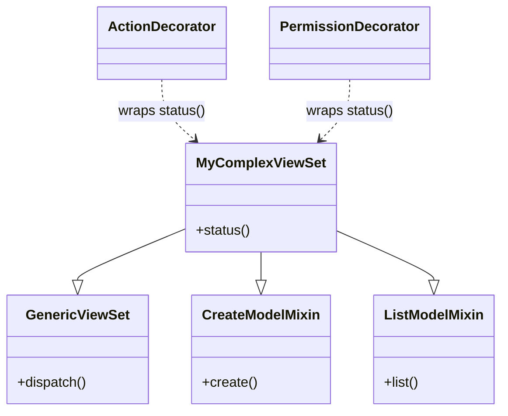

# DECORATOR

# Intent

객체에 동적으로 추가 책임을 부여. 데코레이터는 기능을 확장하기 위한 서브클래싱의 유연한 대안책

# aka.

Wrapper

# Motivation

- 목적
    - 개별 객체에 동적으로 책임이나 기능을 추가하는 방법을 제공
- 문제 해결
    - 상속만으로는 모든 객체에 동일한 기능이 추가되어 유연성이 떨어지는 문제를 해결
- 작동 방식
    - 원본 컴포넌트를 다른 객체(데코레이터)로 감싸도록 작업
    - 데코레이터는 원본 컴포넌트와 동일한 인터페이스를 구현
    - 데코레이터는 요청을 원본 컴포넌트에 위임하고 추가 기능을 수행
- 장점
    - 런타임에 객체에 기능을 동적으로 추가/제거 가능
    - 데코레이터를 중첩해서 여러 기능 조합 가능
    - 클라이언트 코드를 변경하지 않고도 기능확장 가능
    - 기존 기능을 수정하지 않고 새로운 기능을 추가 (OCP)
- 예시
    - `TextView`(기본 컴포넌트)에 `ScrollDecorator`와 `BorderDecorator`를 조합하여 스크롤 기능과 테두리를 추가
    - 클라이언트는 장식된 컴포넌트와 장식되지 않은 컴포넌트를 구분할 필요가 없음

# Applicability

아래 상황에 적절:

- 개별 객체에 동적이고 투명하게 책임을 추가하고 싶을 때, 즉 다른 객체에 영향을 주지 않고 추가하고 싶을 때.
- 나중에 제거할 수 있는 책임을 추가하고 싶을 때.
- 서브클래싱을 통한 확장이 비실용적일 때.
    - 때로는 많은 수의 독립적인 확장이 가능하여 모든 조합을 지원하기 위해 서브클래스가 폭발적으로 증가할 수 있음
    - 또는 클래스 정의가 숨겨져 있거나 서브클래싱을 위해 사용할 수 없는 경우도 존재

# Structure


# Participants

- `Component` (`VisualComponent`)
    - 동적으로 책임이 추가될 수 있는 객체들의 인터페이스를 정의

- `ConcreteComponent` (`TextView`)
    - 추가적인 책임이 부착될 수 있는 객체를 정의

- `Decorator`
    - Component 객체에 대한 참조를 유지하고 `Component` 인터페이스를 준수하는 인터페이스를 정의

- `ConcreteDecorator` (`BorderDecorator`, `ScrollDecorator`)
    - 컴포넌트에 책임을 추가

# Collaborations

Decorator는 요청을 자신의 Component 객체로 전달. 선택적으로 요청을 전달하기 전과 후에 추가 작업을 수행할 수 있음

# Consequences

## 장점

- 동적 기능 확장: 런타임에 객체의 기능을 유연하게 추가하거나 제거 가능
    - 상속과 달리 새로운 클래스를 생성할 필요 없이 기존 객체에 기능을 쉽게 추가 가능
    - 여러 데코레이터를 조합하여 다양한 기능 조합 구성 가능
- 필요한 기능만 선택: "사용한 만큼 지불(_pay-as-you-go_)"하는 방식으로 필요한 기능만 추가가능
    - 복잡한 상속 계층을 만들지 않고도 기본 클래스를 간단하게 유지하면서 필요한 기능만 추가가능
    - 특히 기능이 독립적이고 조합 가능한 경우에 유용

## 단점

- 객체 식별 문제: 데코레이터로 감싼 객체는 원본 객체와 동일하지 않음
    - `obj1 == obj2` 같은 객체 식별 비교가 예상대로 작동하지 않을 수 있음
    - 객체 식별에 의존하는 코드에서는 문제가 될 수 있음
- 복잡성 증가: 많은 작은 객체들이 생성되어 시스템 이해와 디버깅이 어려워질 수 있음
    - 코드베이스에 많은 비슷한 데코레이터 클래스가 생길 수 있음
    - 특히 - 객체 간의 관계를 추적하기 어려울 수 있으며, 특히 많은 데코레이터가 중첩된 경우

## 정리

- 런타임에 객체의 기능을 유연하게 확장해야 하는 경우 매우 유용
- 다만, 시스템이 복잡해질 수 있고 객체 식별 관련 이슈가 발생할 수 있음

# Implementation

## 데코레이터 패턴 적용 시 고려사항

1. 인터페이스 일치성
   데코레이터 객체의 인터페이스는 장식하는 컴포넌트의 인터페이스와 일치해야 함. 따라서 `ConcreteDecorator` 클래스들은 공통 클래스를 상속받아야 함

2. 추상 Decorator 클래스 생략 가능성
   하나의 책임만 추가할 때는 추상 Decorator 클래스를 정의할 필요가 없음; 이미 존재하는 클래스 계층을 다룰 때 자주 발생하는 상황으로, 이 경우 컴포넌트로 요청을 전달하는
   Decorator의 책임을 `ConcreteDecorator` 에 병합가능

3. `Component` 클래스 경량화
   인터페이스 일치를 위해 컴포넌트와 데코레이터는 공통 Component 클래스에서 상속받아야 합니다. 이 공통 클래스는 경량화되어야 하며, 데이터 저장보다 인터페이스 정의에 집중해야 합니다.
   데이터 표현 정의는 서브클래스로 미루어야 합니다. 그렇지 않으면 Component 클래스의 복잡성이 데코레이터를 과도하게 무겁게 만들 수 있습니다.

4. 객체의 겉과 속 변경 비교
   DECORATOR 는 객체의 겉(스킨)을 변경하여 동작을 변경 반면 STRATEGY 패턴은 객체의 속(내부)을 변경하는 대안
    - Component 클래스가 본질적으로 무거울 때는 DECORATOR 패턴보다 STRATEGY 패턴이 더 적합

STRATEGY 패턴에서는 컴포넌트가 일부 동작을 별도의 전략 객체에 위임; 전략 객체를 교체함으로써 컴포넌트의 기능을 변경하거나 확장가능

## DECORATOR vs STRATEGY 패턴 비교

- DECORATOR: 컴포넌트는 데코레이터에 대해 알 필요가 없음(투명성)
- STRATEGY: 컴포넌트가 확장 가능성을 알고 있어야 함, 해당 전략을 참조하고 유지해야 함

전략 기반 접근법은 새로운 확장을 수용하기 위해 컴포넌트 수정이 필요할 수 있지만, 전략은 특화된 인터페이스를 가질 수 있음. 반면 데코레이터의 인터페이스는 컴포넌트와 일치 필요

## 핵심 요약

- DECORATOR 패턴은 객체에 동적으로 새로운 책임을 추가하는 유연한 방법
- 인터페이스 일치성이 중요하며 `Component` 클래스는 경량화되어야 함
- 추상 `Decorator` 클래스는 필요에 따라 생략 가능
- 객체가 본질적으로 무거운 경우, STRATEGY 패턴을 대안으로 고려해야 함 (객체의 겉을 추가하느냐, 객체의 속을 바꾸느냐?)
- DECORATOR는 객체의 외부를 변경하고, STRATEGY는 내부 동작을 변경

# Sample Code

`decorator/src`, `decorator/test` 참조

# Known usages

Django REST Framework 로 REST API를 빠르게 만들 수 있는 방안:

- 객체 생성 자체는 `MyComplexViewSet` 이란 TEMPLATE METHOD로 구성
- 추가 로직은 `mixins` 의 `CreateModelMixin`, `ListModelMixin` 으로 수행할 내부 로직(STRATEGY)을 추가함
- 필요한 기능을 `@action`, `@permission_classes` 로 로직 전후에 처리 (DECORATOR-like)

```python
from rest_framework import (
    viewsets,
    mixins,
)
from rest_framework.decorators import action
from rest_framework.permissions import IsAuthenticated
from rest_framework.response import Response
from rest_framework.decorators import permission_classes


class MyComplexViewSet(
    mixins.CreateModelMixin,
    mixins.ListModelMixin,
    viewsets.GenericViewSet,
):
    """
    - Template Method: GenericViewSet이 전체 구조 제공
    - Strategy: CreateModelMixin, ListModelMixin 조합 전략
    - Decorator: action, permission_classes 데코레이터 사용
    """
    queryset = MyModel.objects.all()
    serializer_class = MyModelSerializer

    @action(detail=False, methods=["get"])
    @permission_classes([IsAuthenticated])
    def status(self, request):
        return Response({"status": "OK"})
```

구조를 살펴보면...



## 파이썬의 `@decorator`?

파이썬의 `@decorator` 는 책에서 말하는 DECORATOR 패턴을 구현한 것은 아님.

- 함수를 인자로 받아서 런타임 전에 수행하고 그 결과를 다시 다른 함수에 넣어주는 구조이기 때문

책에서 말하는 DECORATOR 패턴은:

- 객체지향 설계에서 객체의 책임을 동적으로 추가하기 위한 구조적 패턴
- 명확한 컴포넌트 계층 구조(Component, ConcreteComponent, Decorator, ConcreteDecorator)가 필요
- 모든 참여자가 공통 인터페이스나 추상 클래스를 구현/상속해야함
- 객체 합성(_composition_)을 통해 기능을 확장

> ![NOTE]
> 사용방안과 기대하는 바는 유사하나, GoF에서 시사하는 구현과는 다르다

# Related patterns

- ADAPTER: 데코레이터는 객체의 책임만 변경하고 인터페이스는 유지; 어댑터는 객체에 완전히 새로운 인터페이스를 제공
- COMPOSITE: 데코레이터는 단 하나의 컴포넌트만 가진 퇴화된 컴포지트로 볼 수 있음; 데코레이터는 추가적인 책임을 더하는 것이 목적이며, 객체 집합화를 위한 것이 아님에 유의
- STRATEGY: 데코레이터는 객체의 겉(skin)을 변경하게 해주고, 전략은 객체의 속(guts)을 변경하게 해줌. 필요에 따라 선택 가능
